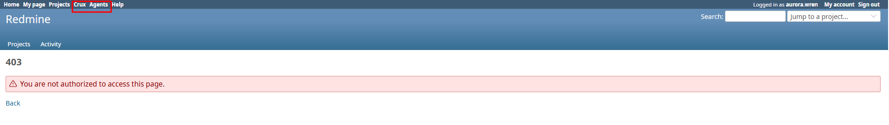

# Bug Report Template

- Bug ID: BUG-CRX-047
- Production Redmine Issue ID: (not yet reported — pending approval)
- Title: Top-menu "Crux"/"Agents" links are shown to every logged-in user regardless of the `view_crux` permission, even though both controllers now correctly 403 anyone who lacks it — a dead-end left behind by the BUG-CRX-012/022 fixes
- Redmine version: 6.0-bookworm (new local Docker instance)
- Plugin name: redmineflux_crux
- Plugin version: 0.62.0
- Environment: Local — `http://localhost:3015` (new dedicated Crux Redmine-6 stack, `C:\crux-redmine`)
- Browser: Chromium (manual, user's browser)
- User role: `aurora.wren` (seed pool user, zero project memberships, Non-member role — confirmed via Rails console: `allowed_to_globally?(:view_crux)` → `false`, Non-member role's Crux permission set is empty)
- Date: 2026-10-09

## Steps to reproduce

1. Log in as any user with no Crux permission granted anywhere (e.g. a brand-new seed user with zero project memberships, so their effective role is Non-member).
2. Look at the top menu.
3. Click "Crux" (or "Agents").

## Expected result

- A menu entry an unprivileged user can't actually use shouldn't be shown to them at all — at minimum, `init.rb`'s `:if` proc for both `menu :top_menu, :crux` and `menu :top_menu, :crux_agents` should check the same `view_crux` permission the controllers themselves now enforce (`User.current.admin? || User.current.allowed_to_globally?(:view_crux)`), consistent with how every other permission-gated Redmine menu entry behaves.

## Actual result

- Both "Crux" and "Agents" are shown in the top menu for `aurora.wren` — confirmed via Rails console that she has zero project memberships and the Non-member role grants no Crux permissions (`view_crux` resolves to `false`). `init.rb`'s menu `:if` procs only check `User.current.logged? && Setting.plugin_redmineflux_crux['nav_top_crux'/'nav_top_agents']` — no permission check at the menu-item level at all (both nav settings are on by default: `nav_top_crux=1`, `nav_top_agents=1`).
- Clicking "Crux" produces Redmine's standard 403 page: "You are not authorized to access this page." No explanation of which permission is missing or who to ask.
- **This is a regression-adjacent gap, not a brand-new defect class.** `CruxDashboardController#authorize_view_dashboard` and `CruxAgentsController#authorize_view_agents` were deliberately hardened by **BUG-CRX-012** and **BUG-CRX-022** (both closed/fixed, confirmed via source: `crux_dashboard_controller.rb` and `crux_agents_controller.rb` both now have `before_action :authorize_...` requiring `view_crux`). Those fixes correctly closed a real data-exposure hole. But the top-menu `:if` procs were never updated to match — so the menu now **advertises a page to users it will then refuse them**, which is strictly worse UX than the pre-fix "login-only, always works" behavior that `testcases/CRUX_NAVIGATION_AND_PERMISSIONS.md`'s TC-CRX-141 originally confirmed live on 2026-09-14 (two days before the BUG-CRX-012 fix landed — that TC's "CONFIRMED LIVE" result is now stale and has been updated in place).
- Directly relevant to the business discussion in this session about message/UX clarity for non-technical users: a user with no technical background has no way to know "You are not authorized to access this page" means "you don't have the Crux permission" — the honest, actionable fix is simply not showing them a link they can't use, same as Redmine already does for every other permission-gated top-menu entry (Administration, Gantt for roles without `view_gantt`, etc.).

## Evidence

### Screenshot

### Retest screenshot (fill after fix is verified)

### Console / log

- Rails console (this instance): `User.find_by(login: 'aurora.wren').allowed_to_globally?(:view_crux)` → `false`; `.memberships.count` → `0`; `Role.non_member.permissions.select { |p| p.to_s.include?('crux') }` → `[]`; `Setting.plugin_redmineflux_crux['nav_top_crux']` → `"1"`, `['nav_top_agents']` → `"1"`.
- `init.rb` (current source, lines ~140-153): both `menu :top_menu, :crux` and `menu :top_menu, :crux_agents` use `if: proc { User.current.logged? && Setting...['nav_top_*'] ... }` — no `allowed_to_globally?(:view_crux)` check anywhere in either condition.

## Duplicate check

- Duplicate found: No — checked `bugs/_duplicates.md` and `bugs/_index.md`. Related to, but distinct from:
  - **BUG-CRX-005** (closed/fixed) — that bug was about the admin-facing on/off *toggle*'s own label being misleading about what it controls (a copy fix). This bug is about the menu's permission-awareness relative to the *user's own role*, independent of the toggle.
  - **BUG-CRX-012** / **BUG-CRX-022** (both closed/fixed) — those added the missing `view_crux` enforcement to the dashboard/agents controllers themselves. This bug is the follow-on gap those fixes left behind: the menu layer was never updated to match the newly-enforced permission.

## Note for triage

Minimal fix: change both `:if` procs in `init.rb` to also require `User.current.admin? || User.current.allowed_to_globally?(:view_crux)`, mirroring exactly what `authorize_view_dashboard`/`authorize_view_agents` already check. No controller change needed — this is purely a menu-visibility fix.
