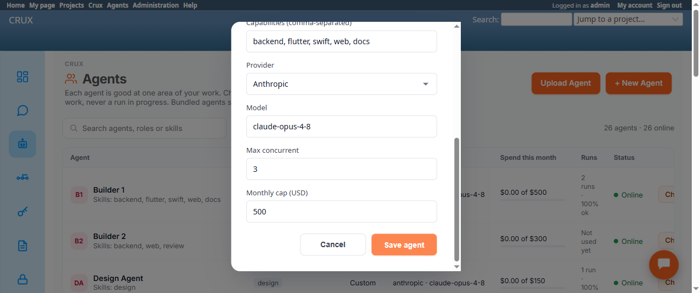

# Bug Report Template

- Bug ID: BUG-CRX-048
- Production Redmine Issue ID: (not yet reported — pending approval)
- Title: Agent registration/edit is completely broken — the server-side agent-ID validation regex can never match a real ID, so every "Register an agent" (create or edit) submission fails with a false "Use lowercase letters, numbers and dashes" error, for every agent, every time
- Redmine version: 6.0-bookworm (new local Docker instance)
- Plugin name: redmineflux_crux
- Plugin version: 0.62.0
- Environment: Local — `http://localhost:3015` (`C:\crux-redmine`)
- Browser: Chromium (Playwright MCP)
- User role: `admin` (Redmine Administrator)
- Date: 2026-10-09

## Steps to reproduce

1. Go to Agent Fleet (`/crux/agents`), List view.
2. Click any agent (e.g. "Builder 1", id `builder-1`) to open its profile, then click "Edit" — OR click "+ New Agent" for a brand-new registration.
3. Without changing the Id field at all (confirmed via DOM: the actual input value is the clean, valid string `builder-1`, 9 characters, no hidden whitespace), click "Save agent".

## Expected result

- Saving an agent whose Id already matches the field's own stated format ("lowercase letters, numbers and dashes") should succeed — the dialog's own help text says "Re-submitting an existing id updates that agent."

## Actual result

- Every submission is rejected with: **"Use lowercase letters, numbers and dashes for the agent ID, for example support-helper."** — reproduced twice in a row (2/2) on the unmodified, already-valid id `builder-1`, confirmed via direct DOM inspection that the submitted value was exactly `builder-1` with no stray characters.
- **Root cause confirmed via source** — `app/controllers/crux_agents_controller.rb`, `agent_form_errors` (line 73):
  ```ruby
  unless params[:id].to_s.match?(/A[a-z0-9][a-z0-9-]*z/)
  ```
  This is missing the backslashes on Ruby's string anchors — it was clearly meant to be `/\A[a-z0-9][a-z0-9-]*\z/` (`\A` = start of string, `\z` = end of string). As written, the regex requires a **literal uppercase "A" character** followed by the lowercase/dash pattern, ending in a **literal lowercase "z" character** — a sequence no normal agent id (which the UI itself instructs to keep lowercase-only) will ever contain. This makes the check fail for **every realistic id, unconditionally** — the validation isn't "too strict," it's checking for the wrong thing entirely.
- **Impact: the entire "Register an agent" feature (both create and edit) is non-functional via the UI** — not a narrow edge case. This is the same `create` action and the same `agent_form_errors` gate for both "+ New Agent" and "Edit", so neither path can ever succeed while this regex is live.

## Evidence

### Screenshot



### Retest screenshot (fill after fix is verified)


### Console / log

- DOM inspection at the moment of the second failed submit: `[{"placeholder":"e.g. hyper-agent-3","value":"builder-1","valueLength":9}, ...]` — confirms the Id field's real value was the clean string `builder-1`.
- Source: `crux_agents_controller.rb:73` — `params[:id].to_s.match?(/A[a-z0-9][a-z0-9-]*z/)`, under the `# CRP-18` comment block (so this appears to be a recent regression introduced by the CRP-18 change, not a long-standing defect).

## Duplicate check

- Duplicate found: No — searched `bugs/_duplicates.md`, `bugs/_index.md`, and the exact error text ("Use lowercase letters, numbers and dashes" / "support-helper") across all bug/testcase/doc files; no prior mention.

## Note for triage

One-character-class fix: change line 73 to
```ruby
unless params[:id].to_s.match?(/\A[a-z0-9][a-z0-9-]*\z/)
```
(or equivalent `=~ /\A.../ ` form). No other part of `agent_form_errors` appears affected.
