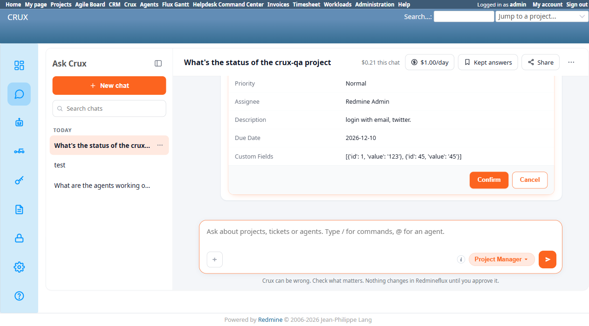

# Bug Report Template

- Bug ID: BUG-CRX-050
- Production Redmine Issue ID: #123060
- Title: Project Manager agent hallucinates wrong custom-field IDs and falsely claims no tool exists to look up custom field options
- Redmine version: 6.0-bookworm (new local Docker instance, localhost:3015)
- Plugin name: redmineflux_crux (Project Manager agent)
- Plugin version: crux-core 0.1.0 / plugin 0.62.0
- Environment: `C:\crux-redmine` (Redmine 6 QA stack)
- Browser: Chromium (Playwright)
- User role: admin
- Date: 2026-10-09

## Steps to reproduce

Project `crux-qa` has two issue custom fields configured: **"Text required feild"** (real id **4**, Text, Required, max length 5) and **"list required feilds"** (real id **5**, List, Required, possible values `Test1`/`Test2`). Neither has a default value. (A third field, "Crux Capability", real id **1**, List type, is unrelated and pre-existing.)

1. Ask Crux (Project Manager agent): "create functional ticket login functionality"
2. Agent asks clarifying questions, including "Do you want to set 'Text required field' and 'list required fields' like you mentioned earlier?"
3. Reply: "description login with email, twitter. Assigned to me Priority high Due date dec-10-2026 text required feild = 123 list rquired feild show me option"
4. Agent responds it cannot look up the list field's options and asks the user to either state the valid options or give the exact value.
5. Separately, ask directly: "List required feilds opetions" (i.e. "show me the valid options for this field").
6. Agent replies: *"Unfortunately, Redmineflux doesn't have a dedicated tool to list custom field definitions and their allowed values from here... Check the Redmineflux Administration panel (Administration → Custom Fields)... or Provide me the exact list of options you want me to choose from."*
7. Reply: "List required field: 45" (supplying a value for the list field, after the agent asked for one).
8. Agent proposes a confirm card. Observe the "Custom Fields" row.
9. Click Confirm.

## Expected result

- A tool to introspect custom field definitions (name, id, format, possible values) genuinely exists in the MCP catalog — `redmineflux_core_list_custom_fields` — and the agent should either call it directly, or discover it via `crux_discover_tool_groups`/`crux_discover_group_tools`, before claiming no such capability exists (per CRX-11's "discover before refusing" rule, already the basis for the false-capability-denial bug class: BUG-CRX-029/032/034).
- When the user explicitly names a custom field ("Text required feild", "list required feilds") and a value, the agent should resolve the field NAME to its real, correct numeric ID — never a different real field's ID, and never a fabricated/nonexistent ID (the existing "never guess a numeric id" rule already enforced for users/teams per BUG-CRX-015/019/038/043 should apply identically to custom fields).
- The resulting `create_issue` call's `custom_field_values` should target id 4 ("Text required feild") and id 5 ("list required feilds") — the two fields the user actually named.
- This isn't specific to List-type fields — Redmine supports 11 custom field formats (Text, Long text, Link, Int, Float, Date, Boolean, List, Key/value list, User, Version, Attachment), each with its own notion of a "valid value" (see Suggested fix table below). The same name→id resolution and options/constraint lookup should work correctly regardless of which format a given field uses.
- **Proactive disclosure, before the user ever hits a validation error:** when the agent is about to propose a `create_issue`/`update_issue` on a tracker that has a required custom field the user hasn't supplied a value for, it should name that field upfront in its own reply (e.g. "this tracker also requires 'Text required feild' — what value should I set?") — not silently build a confirm card and let Redmine's 400 be the first time the user learns the field exists. And specifically **if that required field is an options-type field (List or Key/value list), the agent must list the real valid options in the same message** (e.g. "'list required feilds' is required — valid options are Test1, Test2. Which one?"), since those values are a fixed, discoverable set via `redmineflux_core_list_custom_fields` — making the user guess at a closed set of options, or forcing them out to the native Admin UI to find out, is exactly the gap this bug is about.

## Actual result

1. When asked directly to show the list field's valid options, the agent claimed: **"Redmineflux doesn't have a dedicated tool to list custom field definitions and their allowed values from here."** This is false — `redmineflux_core_list_custom_fields` is a real, registered MCP tool (confirmed present in the live tool catalog for this session). The agent never attempted a `tools/list`/discovery check for it before asserting it doesn't exist — the same false-capability-denial shape as BUG-CRX-029/032/034, now reproduced for custom-field introspection specifically.
2. When later given explicit field names and values ("text required feild = 123", "List required field: 45"), the agent's resulting confirm card's Custom Fields row showed:
   ```
   [{'id': 1, 'value': '123'}, {'id': 45, 'value': '45'}]
   ```
   - **id 1 is "Crux Capability"** (an unrelated, pre-existing field) — NOT "Text required feild" (real id 4). The agent silently misassigned the user's "Text required feild" value to the wrong real field.
   - **id 45 does not exist at all** on this instance (only ids 1, 2, 3, 4, 5 are registered) — appears to be a fabricated/hallucinated ID, likely conflating the VALUE the user typed ("45" from "List required field: 45") with a field ID.
3. On Confirm, the real `create_issue` call (verified via Activity Log, activity `1eaf088e3a5e`: `mcp call tool=redmineflux_core_create_issue ok=true` at the MCP layer, but the proposal-confirm step itself returned HTTP 400) failed Redmine's own validation: **"Validation error: Crux capability is not included in the list; Text required feild cannot be blank; List required feilds cannot be blank."** — proving neither of the two fields the user actually asked to set ever received a value, while an unrelated field (Crux Capability) was wrongly written to with an invalid value. The failure was reported honestly (no fake success) — this part is correct — but the underlying field-resolution logic is broken regardless of outcome.
4. Net effect: **a chat user has no working path to set a List-type required custom field via natural language** — the agent (a) won't admit it could look up the real options, and (b) can't correctly map a field the user explicitly names to its real ID even when told exactly what to do.

## Evidence

### Screenshot



### Console / log

- Activity Log entry `1eaf088e3a5e` (`/crux/admin/logs`): `POST /api/chat/confirm status=400`, `core.askcrux.proposals`: `proposal confirm produced no issue id id=prop-005 tool=redmineflux_core_create_issue raw=Validation error: Crux capability is not included in the list; Text required feild cannot be blank; List required feilds cannot be blank`, `core.askcrux.mcp`: `mcp call tool=redmineflux_core_create_issue duration_ms=91.2 ok=true` (the MCP call itself succeeded in reaching Redmine — `ok=true` refers to the HTTP round-trip, not the business outcome — Redmine's own validation is what rejected it).
- Custom field registry at time of test (`/custom_fields?tab=IssueCustomField`): id 1 = Crux Capability (List), id 2 = Issue Category (List), id 3 = Automation Key (Text), id 4 = Text required feild (Text, Required), id 5 = list required feilds (List, Required, values Test1/Test2).
- No `mcp call tool=redmineflux_core_list_custom_fields` ever appears in this session's Activity Log across the entire investigation (~30+ tool calls logged) — confirming the agent never attempted to call or discover this tool before claiming it doesn't exist.

## Scope — likely not limited to Issue custom fields

This repro used Issue custom fields, but Redmine's custom-field system spans many entity types (`/custom_fields` tabs): **Issues, Spent time, Projects, Versions, Documents, Users, Groups, Activities (time tracking), Issue priorities, Document categories**, plus CRM's own **Contacts, Companies, Deals, Leads**. `redmineflux_core_list_custom_fields` (the tool this bug says is never called) is not Issue-specific — it's the one shared introspection point for all of them. Any agent that creates/updates a record on one of these entity types is a plausible candidate for the same two defects (false "no lookup tool" denial, and wrong/hallucinated field-id resolution) whenever that entity type has a required or options-type custom field configured:

| Entity type | Agent(s) that would hit this |
|---|---|
| Issues | Project Manager (confirmed this bug), also Scrum/QA/Helpdesk/etc. agents that create issues in their own domain |
| Projects | Project Manager, Project Setup Agent |
| Versions | Project Manager (`crux_create_version`-equivalent) |
| Documents | Project Manager |
| Spent time (time entries) | Time Agent, Project Manager (`log_time`) |
| Users, Groups | Project Manager (admin-only paths) |
| Contacts, Companies, Deals, Leads | Sales Agent (CRM) |
| Activities (time tracking), Issue priorities, Document categories | Likely admin-enumeration-only, not agent-writable at all — lower priority to check |

**Not yet verified on any entity type other than Issues** — flagging this as the scope this bug should expand to once a fix is scoped, and as a set of follow-up TCs worth writing (Sales Agent + CRM custom fields is probably the next highest-value one to check, since CRM already has its own history of custom-field-adjacent defects).

## Suggested fix

This bug was reproduced with a Text field and a List field, but the underlying gap applies to **every custom field format Redmine supports**, not just these two — `redmineflux_core_list_custom_fields` (confirmed to exist, never called by the agent) should be the agent's first step whenever a tracker has any custom field involved in a create/update, and its response needs to be surfaced per-format, since each format has a different notion of "what's a valid value":

| Format | What the agent needs to know/show before proposing a value |
|---|---|
| Text | min/max length, regex pattern if set |
| Long text | none beyond "free text" |
| Link | must be a URL |
| Int / Float | numeric, plus min/max if the field defines them |
| Date | expected date format |
| Boolean | only true/false (not an arbitrary string) |
| **List** | the real, exact set of possible values (this bug's repro) — never a guessed/invented option |
| Key/value list | the real key set, not a freeform value |
| **User** | a real user id/login on the project — same "never guess an id from a name" rule already enforced for assignee resolution (TC-CRX-185) must apply here too |
| Version | a real, existing version/milestone on the project |
| Attachment | not settable via a simple value at all |

The core fix is for the agent to call `redmineflux_core_list_custom_fields` (filtered to the relevant tracker/project) to get each involved field's real `id`, `name`, and `format`-appropriate constraint (`possible_values` for List/Key-value, `min_length`/`max_length`/`regexp` for Text, etc.) **before** constructing `custom_field_values` for a create/update proposal — not just when a field happens to be missing/blank, but proactively for any field the user names, regardless of which of the 11 formats it is. This also fixes the false-capability-denial half of this bug (the tool to answer "what are my options" already exists) and the ID-hallucination half (the real id would come from this same lookup instead of being guessed).

## Duplicate check

- Duplicate found: No
- Related (not duplicate): BUG-CRX-029/032/034 (false capability-denial pattern — same shape, different domain/tool); BUG-CRX-015/019/038/043 (fabricated/wrong ID resolution for users/teams/projects — same shape, first instance for custom fields specifically).
