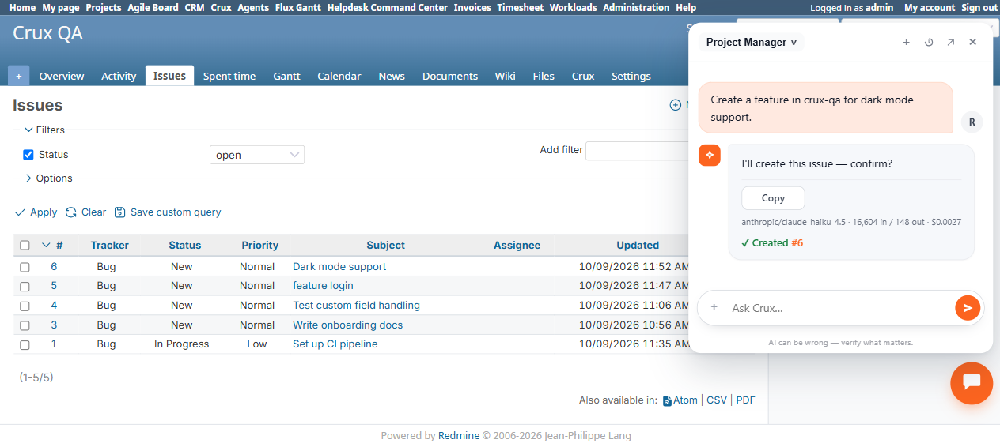

# Bug Report Template

- Bug ID: BUG-CRX-051
- Production Redmine Issue ID: #123061
- Title: Project Manager agent never selects the Feature tracker when explicitly asked to "create a feature" — always falls back to the project's default tracker (Bug)
- Redmine version: 6.0-bookworm (new local Docker instance, localhost:3015)
- Plugin name: redmineflux_crux (Project Manager agent)
- Plugin version: crux-core 0.1.0 / plugin 0.62.0
- Environment: `C:\crux-redmine` (Redmine 6 QA stack)
- Browser: Chromium (Playwright)
- User role: admin
- Date: 2026-10-09

## Steps to reproduce

Project `crux-qa` has 3 trackers enabled: **Bug, Feature, Support** (Bug is first/leftmost in the project's tracker list).

1. Ask Crux (Project Manager agent): "Create a feature in crux-qa for dark mode support."
2. Observe the confirm card's Tracker row.
3. Click Confirm.
4. Check the real created issue's tracker via the native Redmine Issues list.

(Independently reproduced a second time, same session, different phrasing: "in crux qa project create feature login" → issue #5 "feature login" — see Actual result.)

## Expected result

- The user explicitly said "feature" and the project has a real "Feature" tracker enabled. The confirm card's Tracker row should show **Feature**, and the created issue should genuinely use the Feature tracker — not silently fall back to whatever the project's first/default tracker happens to be.
- If the agent is for some reason unable to resolve "feature" to the real Feature tracker (e.g. ambiguous phrasing), it should ask the user to clarify/confirm the tracker — not silently default without telling the user, since tracker choice affects workflow, available fields, and reporting.

## Actual result

- Confirm card showed: `Tracker: (project default)` — not "Feature" — despite the user's message explicitly starting with "Create a feature..."
- On Confirm, the real issue (**#6, "Dark mode support"**) was created with tracker **Bug**, verified via `/projects/crux-qa/issues` (native Redmine UI, not just the chat's own claim).
- **Reproduced a second, independent time** in the same session with different phrasing ("in crux qa project create feature login") → issue **#5, "feature login"** — also created as tracker **Bug**.
- 2/2 reproductions: the agent never once resolved "feature" to the project's real, enabled Feature tracker. It appears the `create_issue` proposal never sets `tracker_id` at all unless the user gives an unambiguous tracker name separately from the word describing the kind of work (e.g. the word "feature" in a sentence is apparently never parsed as a tracker-selection intent) — it just always lets Redmine fall through to the project's first-listed tracker (Bug).
- The confirm card's own "(project default)" label is itself slightly misleading — it implies the agent made a deliberate choice to use the project's default, when in reality it appears to never have considered tracker selection at all for this phrasing.

## Evidence

### Screenshot

### Console / log

- Confirm card (session `ses-007`, 2026-10-09T11:51:51Z): table rows `Project: Crux QA`, `Tracker: (project default)`, `Subject: Dark mode support`, `Description: Implement dark mode support for the application UI.` — no tracker ever proposed as Feature despite the request's own wording.
- Real issues list (`/projects/crux-qa/issues`) after both reproductions: issue #6 "Dark mode support" → Tracker column = Bug; issue #5 "feature login" → Tracker column = Bug. Neither matches the user's stated intent.

## Duplicate check

- Duplicate found: No
- Related (not duplicate): none of the existing wrong-ID-resolution bugs (BUG-CRX-015/019/038/043/050) cover tracker selection specifically — this is a different field (`tracker_id`) on the same `create_issue` call, not a custom field or a user/team id.
