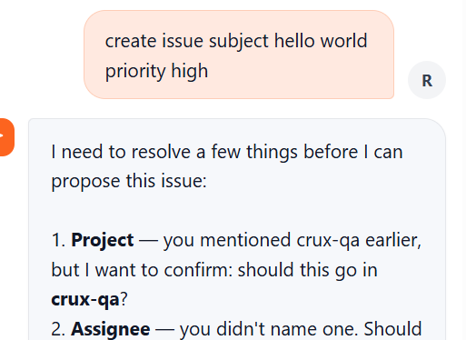
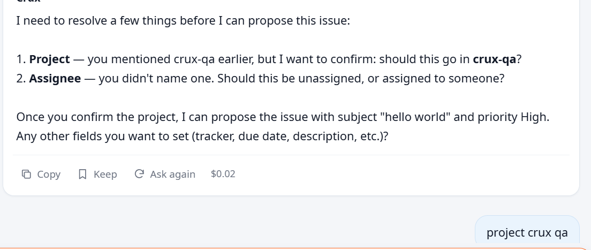
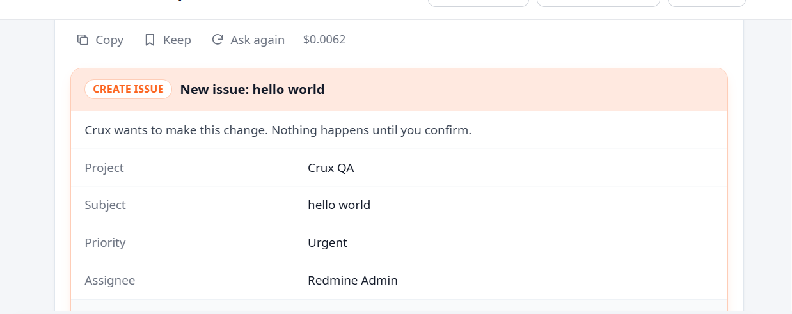
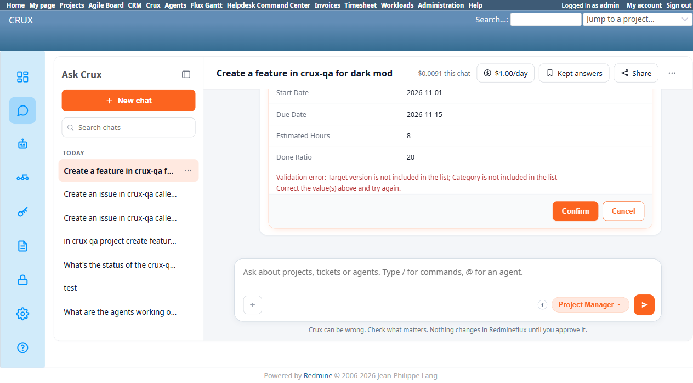
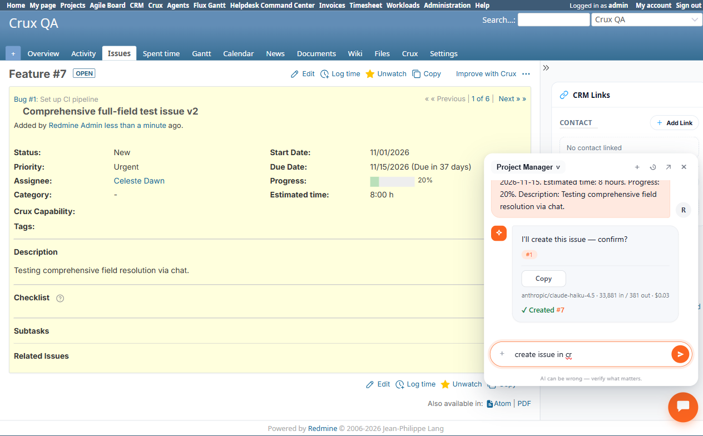

# Bug Report Template

- Bug ID: BUG-CRX-052
- Production Redmine Issue ID: #123062
- Title: Project Manager agent maps Priority "High" to "Urgent" (3/3 reproductions, incl. a fresh single-turn session) — plus Category/Target Version resolve wrong on a multi-field create_issue, including using an ID its own tool just reported as 404
- Redmine version: 6.0-bookworm (new local Docker instance, localhost:3015)
- Plugin name: redmineflux_crux (Project Manager agent)
- Plugin version: crux-core 0.1.0 / plugin 0.62.0
- Environment: `C:\crux-redmine` (Redmine 6 QA stack)
- Browser: Chromium (Playwright)
- User role: admin
- Date: 2026-10-09

## Steps to reproduce

Project `crux-qa` has: 3 trackers (Bug, Feature, Support), 14 issue categories (incl. "Default Category" and "DevOps - Cloud and Server"), one version "v1.0" (just created, real id does NOT equal `1`), 2 members (Luna Blossom/Manager, Celeste Dawn/Developer), standard Redmine priorities (Low/Normal/High/Urgent/Immediate).

1. Ask Crux (Project Manager agent), all in a single message:
   > "Create an issue in crux-qa with these exact details: Subject: Comprehensive full-field test issue. Tracker: Feature. Assignee: Celeste Dawn. Category: DevOps - Cloud and Server. Target version: v1.0. Parent task: issue #1 (Set up CI pipeline). Start Date: 2026-11-01. Due Date: 2026-11-15. Estimated time: 8 hours. Progress: 20%. Priority: High. Description: Testing comprehensive field resolution via chat."
2. Observe the confirm card's field values against what was actually asked for.
3. Click Confirm, observe the result.

## Expected result

- **A real user only ever gives a NAME, never an ID.** Nobody writing to Crux in plain language says "set category_id to 7" or "priority_id 3" — they say "High priority," "DevOps - Cloud and Server," "v1.0," "Celeste Dawn." Resolving that name to the real underlying id/value — correctly, every time — is entirely the agent's own responsibility; there is no fallback where the user bails it out with the id directly, because the user does not know it and has no reason to. So "the agent usually gets it right" is not good enough: every one of these fields needs a real, verified lookup before it goes into a proposal, not a guess that happens to be right often enough.
- Every explicitly named field should resolve to its real, correct value/ID: Tracker=Feature, Priority=High, Category="DevOps - Cloud and Server", Target Version="v1.0" (the real version, whatever its actual id is), Assignee=Celeste Dawn, Parent=#1, plus the literal dates/hours/progress given.
- If the agent's own tool call reports a record doesn't exist (e.g. a 404 on `get_version`), the agent must never use that same ID anyway in the actual write — it should either re-resolve correctly (e.g. via `list_versions`) or tell the user it couldn't find the named version, never silently proceed with a value its own tooling just proved wrong.

## Root cause

Every one of the 3 wrong fields traces back to the same thing: the agent is not reliably running a **list → search-by-name → use the matched real id** sequence before writing a name-given field into the proposal. The Activity Log shows three different ways this shows up for a field the agent was given only a name for:

| Field | What should have happened | What actually happened |
|---|---|---|
| Category | Call `redmineflux_core_list_issue_categories`, find the entry whose name matches "DevOps - Cloud and Server", use its real id | `redmineflux_core_get_issue_category` called once against a guessed id — never searched the real list at all |
| Target Version | Call the real list-versions tool, find the entry named "v1.0", use its real id | Guessed `1` directly, `get_version` confirmed that guess was wrong (404), and the wrong id was used anyway — the one case here where the agent had unambiguous proof of its own error and ignored it |
| Priority | Call `list_priorities` (it did), search the result for "High", use that entry's id | List was fetched correctly, but the match step picked "Urgent" instead of "High" — a plain selection error on correctly-fetched data, the only one of the three NOT explained by "it skipped the lookup" |

Contrast with the same request's Assignee (`list_users` → matched "Celeste Dawn" → correct) and Tracker (`list_trackers` → matched "Feature" → correct): when the full lookup-then-match sequence actually runs, it works. The defect is that this sequence isn't consistently triggered for every name-given field in a single request — some fields get it, some get a shortcut guess, and even when the right list is fetched (Priority), the matching step itself can still fail.

## Follow-up reproduction, same session — Priority fabricated even when not mentioned at all, and this one went all the way to a real created issue

Per user instruction, re-sent the same request with the 3 broken fields (Priority, Category, Target Version) removed entirely — leaving only Subject, Tracker, Assignee, Parent task, Start/Due Date, Estimated time, Progress, Description, none of which mention priority in any way:

> "Create an issue in crux-qa with these exact details: Subject: Comprehensive full-field test issue v2. Tracker: Feature. Assignee: Celeste Dawn. Parent task: issue #1 (Set up CI pipeline). Start Date: 2026-11-01. Due Date: 2026-11-15. Estimated time: 8 hours. Progress: 20%. Description: Testing comprehensive field resolution via chat."

The resulting confirm card still showed **`Priority: Urgent`** — carried over from the earlier (Cancelled) turn's wrong resolution, never requested in this message at all. This time there was no conflicting custom field/category/version to trigger a validation error, so **Confirm genuinely succeeded**: real issue **#7** ("Comprehensive full-field test issue v2") was created with Priority = Urgent, verified directly on `/issues/7`. Every other field this time resolved correctly (Tracker: Feature, Assignee: Celeste Dawn, Category: none/"-" since not asked, Start/Due dates, 8h estimated, 20% done) — Priority was the only field wrong, and it was wrong with no prompting of any kind.

**This is a more severe variant than the original finding**: it isn't just "given a name, resolves to the wrong value" — it's "a wrong value from an earlier, abandoned proposal in the same chat session leaks into a completely unrelated later proposal that never mentions the field at all," and this time nothing stopped it from actually writing to Redmine. This points to a likely root cause beyond simple per-field name resolution: some form of session/conversation state (possibly the model re-using earlier assistant-turn content, or a proposal-building step that doesn't fully reset field state between proposals in the same session) is carrying a stale, wrong value forward. Needs dev investigation into whether `create_issue` proposal construction retains any state across turns within a session.

## Third, independent reproduction — a brand-new session, no prior turns, "High" still resolves to "Urgent"

The user independently reproduced this in a completely separate, fresh chat (no relation to the sessions above — rules out any session/conversation-state leak as the sole explanation):

1. "create issue subject hello world priority high"
2. Agent asked 2 clarifying questions (Project, Assignee) — and in its OWN clarifying reply, **correctly restated the user's intent in plain text**: *"Once you confirm the project, I can propose the issue with subject 'hello world' and priority High."* — so at this point the model itself knows and has just said the right word, "High."
3. User replied: "project crux qa"
4. The resulting confirm card showed: Project: Crux QA, Subject: hello world, **Priority: Urgent**, Assignee: Redmine Admin (defaulted, reasonable since never specified).

**This is the third independent reproduction of the exact same mapping error (user says/agent itself says "High" → final proposal shows "Urgent"), now confirmed in a session with zero prior turns to leak from.** This rules out "stale session state" as the sole cause and strongly suggests a **systematic, deterministic mis-mapping specifically between "High" and "Urgent"** — not a random LLM slip, and not exclusively a cross-turn leak (that mechanism explains the 2nd reproduction above, but not this clean, single-turn one). Worth checking directly: does the priority list's real ordering/ids have "High" and "Urgent" adjacent (e.g. Low/Normal/High/Urgent/Immediate), and is there an off-by-one index error in however the proposal-building step turns a matched priority name into the id/label it actually renders? 3/3 reproductions so far have all shown this exact High→Urgent substitution, never any other mismatch pair — a specific, narrow pattern worth root-causing directly rather than treating as generic "sometimes picks wrong."

## Actual result

Out of 11 fields given, **8 resolved correctly** (Tracker: Feature ✓, Assignee: Celeste Dawn ✓, Parent Issue: #1 ✓, Start Date ✓, Due Date ✓, Estimated Hours: 8 ✓, Done Ratio: 20 ✓, Description ✓) and **3 resolved wrong**, each in a different way:

1. **Priority: silently wrong, not caught by anything.** Confirm card showed `Priority: Urgent` — the user asked for "High". This is NOT a missing-lookup problem: the Activity Log confirms `mcp call tool=redmineflux_core_list_priorities ok=true` was genuinely called and returned the real priority list in the same turn. The agent had the correct reference data and still picked the wrong enum value. Because "Urgent" is itself a real, valid priority, Redmine's own validation has no way to catch this — **this is the most dangerous of the three, since nothing stops it from silently succeeding with the wrong value** (not actually confirmed to completion in this repro — Cancel was clicked once the other 2 errors were found — but nothing in the flow would have caught this one on its own).
2. **Target Version: used an ID its own tool had just proven invalid.** The Activity Log shows: `mcp call tool=redmineflux_core_get_version ok=false error=... "Version/milestone #1 not found... The ID or identifier you provided does not exist"`. Despite this explicit 404, the confirm card still proposed `Fixed Version: 1`, and confirming it produced Redmine's own validation error: **"Target version is not included in the list."** No `redmineflux_core_list_versions`-equivalent lookup was ever attempted to find the real version by name ("v1.0") — the agent appears to have guessed `1` as a plausible id, had that guess explicitly refuted by its own tool call, and used the refuted value anyway.
3. **Category: wrong value, real lookup tool never called.** Confirm card showed `Category: Default Category` — the user asked for "DevOps - Cloud and Server" (one of the project's 14 real categories). The Activity Log shows only `mcp call tool=redmineflux_core_get_issue_category ok=true` (a single-record fetch, succeeded) — never `redmineflux_core_list_issue_categories` (the actual tool that would return the real category list to search/match against by name). Confirming this also produced Redmine's own validation error: **"Category is not included in the list"** — meaning the single category record fetched (presumably via a guessed id) doesn't even belong to this project's own category set.

**Net result**: a user who gives every field explicitly, by name, in one message — exactly what a well-specified request should look like — gets roughly a 70% field-accuracy rate, with one of the 3 wrong fields (Priority) having no safety net at all.

## Evidence

### Screenshot

### Console / log

- Activity `e37d6107fa11` (proposal build, `/crux/admin/logs`):
  - `mcp call tool=redmineflux_core_get_version duration_ms=33.1 ok=false error=... Version/milestone #1 not found` — tool explicitly said this ID doesn't exist.
  - `mcp call tool=redmineflux_core_get_issue_category duration_ms=128.7 ok=true` — succeeded, but fetched the wrong category (never searched the real list).
  - `mcp call tool=redmineflux_core_get_user duration_ms=71.3 ok=true` and `mcp call tool=redmineflux_core_list_users duration_ms=95.8 ok=true` — these two, for Assignee, DID resolve correctly (Celeste Dawn) — proving the agent is capable of correct list-then-match resolution when it actually does it.
  - `mcp call tool=redmineflux_core_list_priorities duration_ms=27.8 ok=true` — real priority list fetched, but the wrong one (Urgent) was still selected in the final proposal.
  - `mcp call tool=redmineflux_core_list_trackers duration_ms=28.8 ok=true` — this one resolved correctly (Tracker: Feature), another case of the list-then-match approach working when used.
- Activity `93fce7376fca` (confirm attempt, `/crux/admin/logs`): `POST /api/chat/confirm status=400`, `proposal confirm produced no issue id ... raw=Validation error: Target version is not included in the list; Category is not included in the list Correct the value(s) above and try again.`

## Duplicate check

- Duplicate found: No
- Related (not duplicate): BUG-CRX-050 (same underlying pattern — wrong/hallucinated id resolution instead of a real list-then-match lookup — but that bug is scoped to custom fields specifically; this one is the first instance on CORE issue fields: Priority, Category, Target Version). BUG-CRX-015/019/038/043 (earlier instances of the same general "never guess an id" principle being violated, on users/teams/projects, not these fields).
