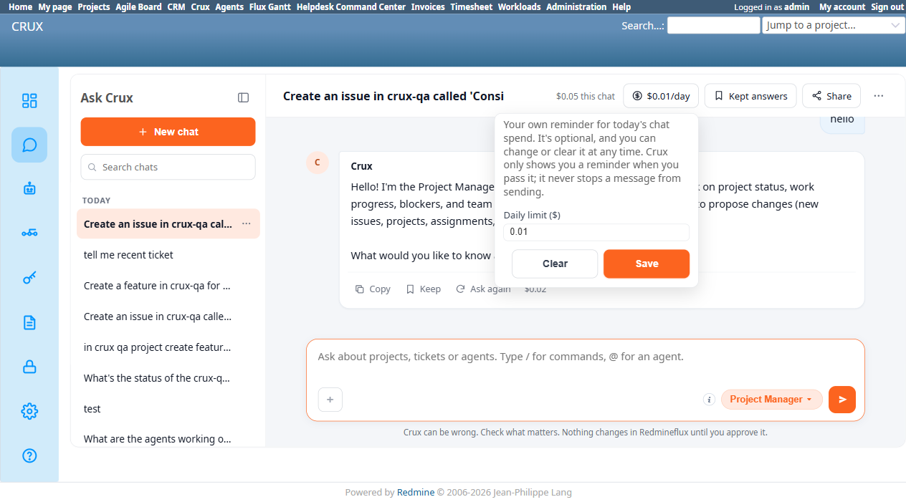
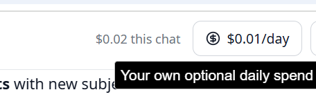
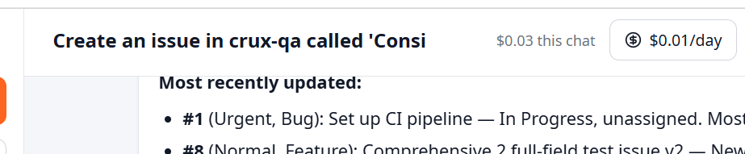

# Bug Report Template

- Bug ID: BUG-CRX-053
- Production Redmine Issue ID: #123064
- Title: "Daily spend reminder" never fires despite being genuinely exceeded, and actually tracks only the current chat's own total — not the user's real spend for the day across sessions
- Redmine version: 6.0-bookworm (new local Docker instance)
- Plugin name: redmineflux_crux (Ask Crux chat UI)
- Plugin version: 0.62.0
- Environment: Local — `http://localhost:3015` (`C:\crux-redmine`)
- Browser: Chromium (Playwright + user's own browser, both reproduced it)
- User role: admin
- Date: 2026-10-09

## Steps to reproduce

1. Open any Ask Crux chat. Click the "$X.XX/day" button next to the chat's own running cost total.
2. Read the tooltip/panel text: "Your own reminder for today's chat spend. It's optional, and you can change or clear it at any time. Crux only shows you a reminder when you pass it; it never stops a message from sending."
3. Set "Daily limit ($)" to a low value, e.g. `0.01`, and Save.
4. Continue chatting in the same session until "This chat in total" genuinely exceeds the set limit (easy — a single real tool-using turn already costs $0.002–$0.05 depending on context size).
5. Send another message after the limit has already been exceeded.
6. Separately: open several different chat sessions across a single real working day (a normal usage pattern for any real user) and look at each one's own cost badge.

## Expected result

- Once the user's actual spend has genuinely passed the limit they configured, Crux should show them a reminder — this is the feature's own explicit, stated promise, not an inference.
- A control explicitly labelled "$X/**day**" and "**Daily** limit" and "today's chat spend" should compare against the user's real total spend for the calendar day, not a single chat's own isolated total — a user who works across multiple sessions in one day (a completely ordinary usage pattern, not an edge case) has no way to see or be warned about their actual daily total anywhere in the product.

## Actual result

1. **No reminder ever appeared, in any form**, despite the limit being genuinely and repeatedly exceeded. Reproduced live: set the limit to $0.01, chat total was already $0.03 (3x over) at the moment of setting it, sent another message bringing it to $0.05 (5x over) — no banner, toast, highlighted badge, or any other visible indicator appeared anywhere on the page, before or after crossing the threshold. The feature's own tooltip explicitly promises "Crux only shows you a reminder when you pass it" — this promise does not hold.
2. **The label is mismatched with what's actually tracked.** The button says "$X/day", the field says "Daily limit ($)", and the tooltip says "today's chat spend" — all day/daily-oriented language — but the actual number being compared is "This chat in total," a single session's own running cost, shown and reset per chat (confirmed via the user's own screenshots: two different chats on the same day show "$0.02 this chat" and "$0.03 this chat" as two separate, non-cumulative figures, each against the same "$0.01/day" reminder). A user who has multiple chat sessions in one day — normal usage, not a stress case — has no visible total anywhere that represents their actual spend for that calendar day, and the "daily" reminder can never meaningfully fire against their real daily total, only (apparently not even reliably) against whichever single chat happens to be open.

## Evidence

### Screenshot

User-provided reproduction (two separate chats, same day, each showing its own isolated total against the same "$0.01/day" reminder):

### Console / log

- No console errors or warnings observed around the limit-crossing message send — the absence isn't an exception being swallowed, the reminder logic appears to simply never trigger (or never render anything when it does).
- Panel text verbatim (captured via accessibility snapshot): "Your own reminder for today's chat spend. It's optional, and you can change or clear it at any time. Crux only shows you a reminder when you pass it; it never stops a message from sending." / field label "Daily limit ($)" / button label "$0.01/day".

## Duplicate check

- Duplicate found: No — checked `bugs/_duplicates.md` and `bugs/_index.md`; no prior mention of spend reminders, cost tracking, or this UI area.

## Note for triage

Two distinct things to fix, likely related in the same component:
1. The reminder-display logic needs to actually fire when the configured limit is passed — right now it appears to never render anything, contradicting its own stated behavior.
2. Decide and fix the scope mismatch: either (a) rename the feature to be honestly per-chat ("chat spend reminder," not "daily"), or (b) make it genuinely track and compare against the user's real cumulative spend for the calendar day across all their sessions, matching what the current labels and tooltip text already promise.
