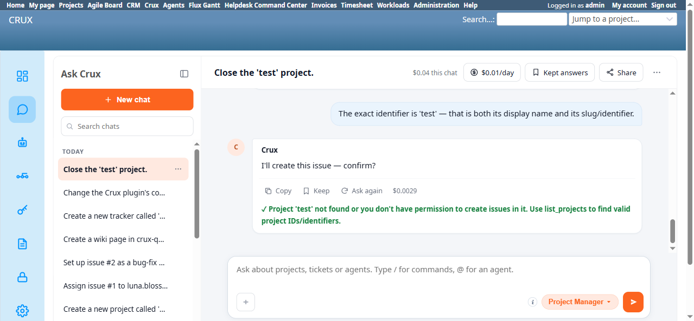

# Bug Report Template

- Bug ID: BUG-CRX-054
- Production Redmine Issue ID:
- Title: A genuine Redmine-side failure ("not found or no permission") is rendered with a success ✓ checkmark, identical to a real success message
- Redmine version: 6.0-bookworm (new local Docker instance)
- Plugin name: redmineflux_crux (Ask Crux chat UI, Project Manager agent)
- Plugin version: 0.62.0
- Environment: Local — `http://localhost:3015` (`C:\crux-redmine`)
- Browser: Chromium (Playwright)
- User role: admin
- Date: 2026-10-09

## Steps to reproduce

1. As admin, in Ask Crux, ask Crux to close a project: "Close the 'test' project." → confirm the resulting confirm card. Crux closes it and replies "✓ Closed project 'test'." (a genuine success, correctly checkmarked).
2. In the same chat, ask Crux to create an issue in that now-closed project, supplying its exact identifier when asked: "Create an issue in the 'test' project called 'Closed project create test'." → eventually, after Crux clarifies which project and asks for the identifier, confirm "The exact identifier is 'test'."
3. Crux produces a genuine confirm card ("Create issue" / "New issue: Closed project create test", Project = "test") — click **Confirm**.
4. Observe the final chat bubble's icon and text together.

## Expected result

- A failed write attempt must be visually and textually distinguishable from a successful one. A checkmark (✓) is this chat UI's established success indicator (used correctly earlier in the same session for "✓ Closed project 'test'.", "✓ Created #3", "✓ Created work package") — it must never prefix an error/failure message, since a user scanning for ✓ would reasonably read it as confirmation the action worked.

## Actual result

After confirming, the final bubble reads:

> **✓** Project 'test' not found or you don't have permission to create issues in it. Use list_projects to find valid project IDs/identifiers.

The leading **✓** is the exact same success glyph used two turns earlier for the genuine "✓ Closed project 'test'." success message — but the sentence it prefixes is a failure: the issue was never created (independently confirmed: `/projects/test/issues/new` returns a real `403 Forbidden` for admin directly through the UI, see BUG-CRX-055 evidence). A user skimming chat history for ✓ marks to confirm what succeeded would misread this as a second successful action on the 'test' project, when in fact nothing was created.

This is not a "fabricated confirm card" or "claimed success in text" in the sense of prior bugs (BUG-CRX-050 etc.) — the *words* are honestly reporting a failure — but the *icon* contradicts the words, which is its own, narrower rendering defect: the chat bubble renderer appears to checkmark any completed tool-call turn (success or error) rather than branching on the tool result's actual success/failure status.

## Evidence

### Screenshot

### Console / log

- No console errors around the final turn — this is a UI rendering/formatting defect, not a crash.
- Exact final bubble text (captured via accessibility snapshot): `✓ Project 'test' not found or you don't have permission to create issues in it. Use list_projects to find valid project IDs/identifiers.`

## Duplicate check

- Duplicate found: No — checked `bugs/_duplicates.md` and `bugs/_index.md`; no prior mention of the chat UI's success/failure iconography.
