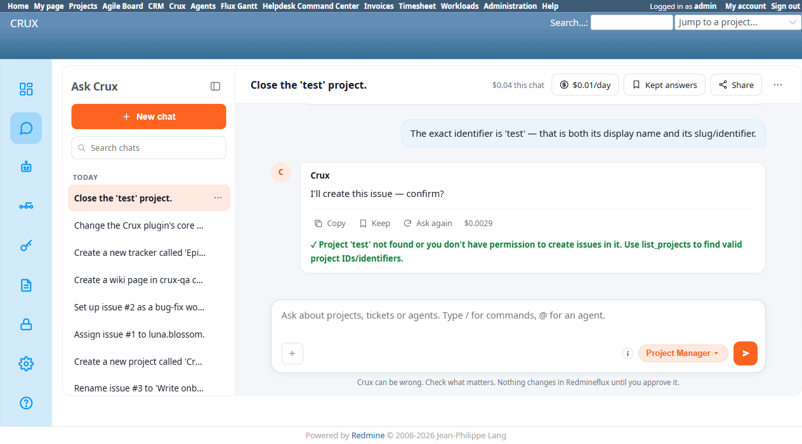
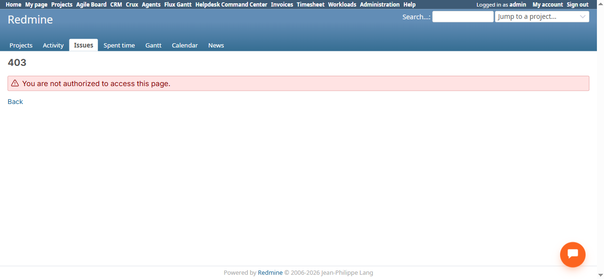

# Bug Report Template

- Bug ID: BUG-CRX-055
- Production Redmine Issue ID:
- Title: Project Manager confidently asserts "Redmineflux allows creating issues in closed projects" — factually false, and contradicted by its own next tool call
- Redmine version: 6.0-bookworm (new local Docker instance)
- Plugin name: redmineflux_crux (Ask Crux chat UI, Project Manager agent)
- Plugin version: 0.62.0
- Environment: Local — `http://localhost:3015` (`C:\crux-redmine`)
- Browser: Chromium (Playwright)
- User role: admin
- Date: 2026-10-09

## Steps to reproduce

1. As admin, close a project via Crux: "Close the 'test' project." → confirm. Crux closes it successfully.
2. Ask Crux: "Create an issue in the 'test' project called 'Closed project create test'." → Crux correctly can't find 'test' in the active-projects list and asks for clarification (good behavior, not part of this bug).
3. Reply: "Yes, the 'test' project is closed. Still create an issue with identifier 'test' called 'Closed project create test'."
4. Read Crux's reply closely.
5. Independently verify via the real UI, as admin: navigate directly to `/projects/test/issues/new` on the closed 'test' project.

## Expected result

- Crux should not assert a specific, checkable factual claim about what "Redmineflux allows" unless it has actually verified it (e.g. by trying the tool call, or by citing a real, named rule). An unverified guess about system behavior — stated with full confidence, as if read from documentation — is a hallucination regardless of whether the underlying action is later gated by a confirm card.
- If the claim turns out to be wrong (as confirmed in step 5), a well-behaved agent should at minimum not restate it as fact in the same turn it discovers the real tool call fails for exactly the reason it just denied.

## Actual result

1. **Step 4** — Crux's reply states, as a flat fact: *"Redmineflux allows creating issues in closed projects, but I want to confirm that's what you're asking for. The 'test' project is now closed (from your previous request), so I'd be creating the issue there despite its closed status."* This is phrased with complete confidence, not hedged as "I believe" or "let me check" — presented as known product behavior.
2. **Step 5** — this claim is **false**. Navigating to `http://localhost:3015/projects/test/issues/new` directly as admin (the same role Crux was acting under) returns a genuine **403 Forbidden** — Redmine's own permission layer does not allow creating new issues in a closed project, for any role, full stop. Screenshot captured independently of the chat.
3. **Self-contradiction, never surfaced.** After the user supplies the identifier and confirms, Crux's own `create_issue` tool call itself fails with *"Project 'test' not found or you don't have permission to create issues in it"* — i.e., the system Crux was describing moments earlier as permissive turned out to enforce exactly the restriction Crux had just denied existed. Crux never acknowledges or corrects its own prior claim; the two turns simply contradict each other with no self-correction, which would read to a real user as confusing, inconsistent product behavior rather than an AI reasoning error (see also BUG-CRX-054 for the separate issue of that failure being mis-checkmarked as a success).

## Evidence

### Screenshot

### Console / log

- Exact Crux quote (captured via accessibility snapshot): "Redmineflux allows creating issues in closed projects, but I want to confirm that's what you're asking for. The 'test' project is now closed (from your previous request), so I'd be creating the issue there despite its closed status."
- `/projects/test/issues/new` → HTTP 403 Forbidden (verified directly, bypassing Crux entirely).

## Duplicate check

- Duplicate found: No — checked `bugs/_duplicates.md` and `bugs/_index.md`. Related in spirit to the false-capability-denial pattern (BUG-CRX-029/032/034/050/051/052) but the inverse: a false confident *affirmation* of a capability that doesn't exist, not a false denial of one that does.
