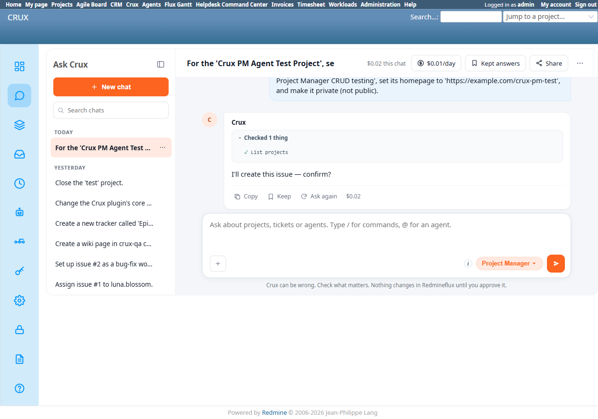
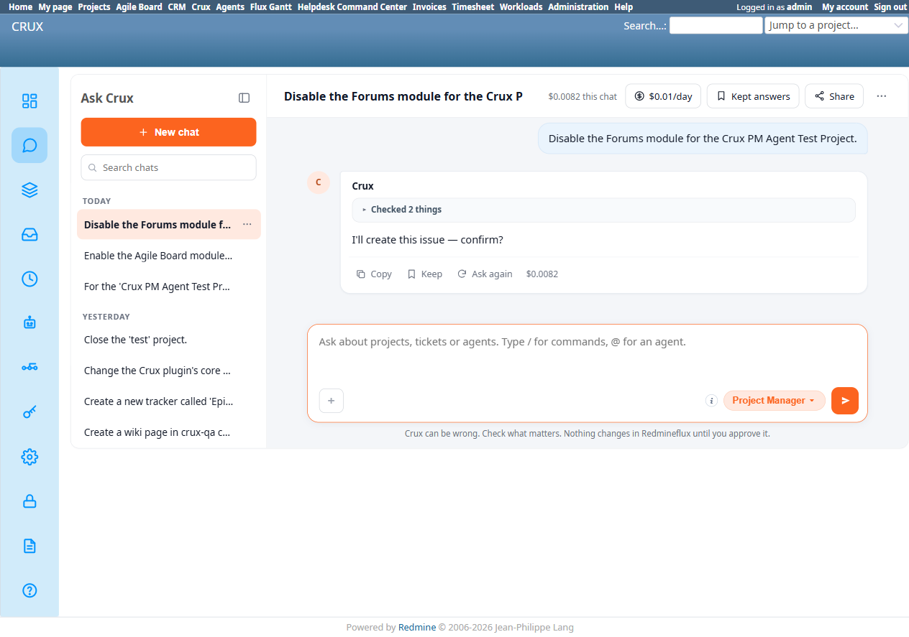
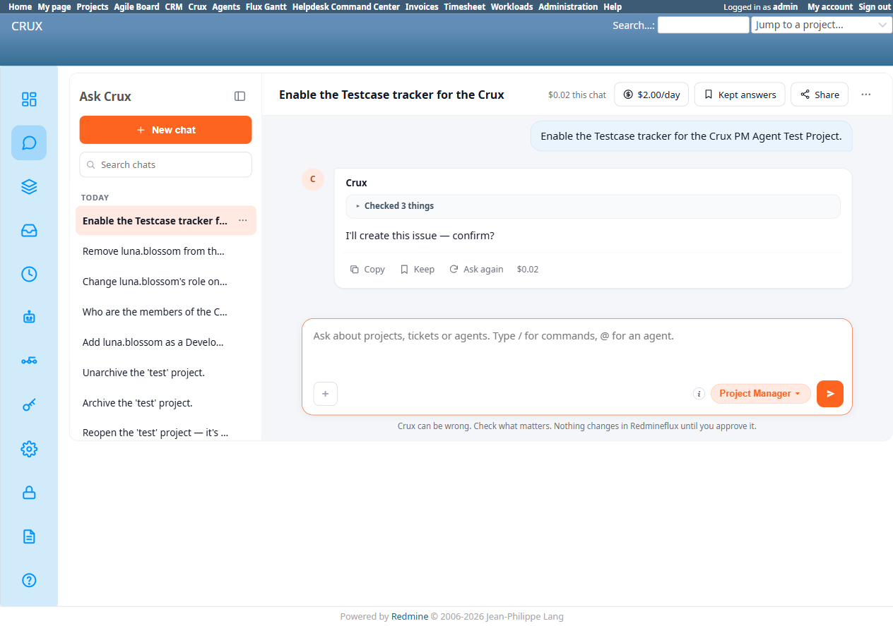

# Bug Report Template

- Bug ID: BUG-CRX-056
- Production Redmine Issue ID:
- Title: Every `update_project`-shaped write request (field update, module enable, module disable, tracker enable) produces the identical fabricated "I'll create this issue — confirm?" proposal with no real Confirm/Cancel button or detail table at all — 4/4 reproductions
- Redmine version: 6.0-bookworm (new local Docker instance)
- Plugin name: redmineflux_crux (Ask Crux chat UI, Project Manager agent)
- Plugin version: 0.62.0
- Environment: Local — `http://localhost:3015` (`C:\crux-redmine`)
- Browser: Chromium (Playwright)
- User role: admin
- Date: 2026-10-10

## Steps to reproduce

**Repro 1 — multi-field update:**
1. As admin, start a fresh Ask Crux chat with the Project Manager agent.
2. Send: "For the 'Crux PM Agent Test Project', set its description to 'QA regression fixture for Project Manager CRUD testing', set its homepage to 'https://example.com/crux-pm-test', and make it private (not public)."
3. Wait for the response to fully settle (verified stable after 8+ additional seconds — not a mid-stream render).
4. Expand the "Checked 1 thing" disclosure above the reply.
5. Independently check the real project at `/projects/crux-pm-agent-test-project/settings/info` to see whether anything actually changed.

**Repro 2 — module enable (fresh chat, different operation entirely):**
1. New chat, same project. Send: "Enable the Agile Board module for the Crux PM Agent Test Project."
2. First attempt hit an unrelated transient error ("MCP session expired (404)") — a one-off side effect of a crux-core container restart earlier in the session, not part of this defect. Clicked "Ask again" to retry the identical request.
3. The retry reproduced the exact same "I'll create this issue — confirm?" text, this time under "Checked 2 things" (✓✓, presumably `list_projects` + `get_project`).
4. Independently checked `/projects/crux-pm-agent-test-project/settings/info` — the "Agile Board" checkbox is still unchecked, confirming no silent execution happened here either.

**Repro 3 — core module disable (fresh chat, opposite direction, and a genuine core Redmine module this time, not a plugin one):**
1. New chat, same project. Send: "Disable the Forums module for the Crux PM Agent Test Project." (Forums is one of Redmine's own built-in modules — Issue tracking, Time tracking, News, Documents, Files, Wiki, Repository, Forums, Calendar, Gantt — as opposed to Repro 2's "Agile Board," which is a plugin-contributed module; Forums was confirmed enabled beforehand.)
2. Reproduced the exact same "I'll create this issue — confirm?" text again, under "Checked 2 things" — no Confirm/Cancel buttons, no table.
3. Independently checked `/projects/crux-pm-agent-test-project/settings/info` — the "Forums" checkbox is still checked, confirming no silent execution.

**Repro 4 — Issue tracking tab, enabling a tracker (different Project Settings sub-tab entirely, not Project/Info):**
1. New chat, same project. Send: "Enable the Testcase tracker for the Crux PM Agent Test Project." (Testcase is one of the 4 trackers available — Bug, Feature, Support, Testcase — and was confirmed unchecked beforehand on `/projects/crux-pm-agent-test-project/settings/issues`.)
2. Reproduced the exact same "I'll create this issue — confirm?" text again, under "Checked 3 things" — no Confirm/Cancel buttons, no table.
3. Independently checked `/projects/crux-pm-agent-test-project/settings/issues` — the "Testcase" checkbox is still unchecked, confirming no silent execution. This confirms the bug isn't scoped only to the Project/Info sub-tab's fields+modules — the Issue tracking sub-tab's tracker list hits the identical failure, since both are ultimately the same `update_project` API call under the hood.

## Expected result

- A genuine, real-tool-backed confirm card naming the actual tool (`Core Update Project` or equivalent) and a table listing exactly the 3 requested field changes (Description, Homepage, Public→false), with real Confirm/Cancel buttons — the same shape every other successful write proposal in this suite has shown (e.g. TC-CRX-182's "Create issue" card, TC-CRX-198's "Core Set Project Closed" card).
- At minimum, the proposal text should describe the actual requested action (a project update), not a different, unrelated operation.

## Actual result

1. The agent correctly called `list_projects` first (shown under "Checked 1 thing" → "✓ List projects") — a reasonable step to resolve "Crux PM Agent Test Project" to its real identifier.
2. The reply text is: **"I'll create this issue — confirm?"** — completely wrong. Nothing in the request mentioned creating an issue; the request was entirely about updating 3 existing project fields.
3. **No Confirm/Cancel buttons were rendered at all**, and **no detail table** showing what would change — only "Copy" / "Keep" / "Ask again" (the same three buttons present on every plain informational reply, not a write proposal). This is the same defect shape as the already-fixed BUG-CRX-020 ("fabricated confirm proposals render with no real Confirm/Cancel button") — a new recurrence, this time on a project-update request rather than the original CRM/Budget/QA/Timesheet/Invoicing domains BUG-CRX-020 covered.
4. Verified independently: nothing changed on the real project. `/projects/crux-pm-agent-test-project/settings/info` still shows Description empty, Homepage empty, Public still checked — so this is not a silent-execution issue, but the proposal itself is both mislabeled and non-functional (a user clicking "confirm" in their head has nothing to actually click).

## Evidence

### Screenshot

### Console / log

- Exact reply text (captured via accessibility snapshot): `I'll create this issue — confirm?` followed immediately by Copy/Keep/Ask again — no Confirm/Cancel, no table.
- Tool trail shown in "Checked 1 thing": `✓ List projects` only — no `update_project` (or equivalent) call was ever made or proposed.

## Note for triage

The identical exact string "I'll create this issue — confirm?" appeared on **4 completely unrelated operations** in 4 separate fresh chats: a 3-field project update (description/homepage/public), enabling a plugin module (Agile Board), disabling a genuine core Redmine module (Forums), and enabling a tracker on the separate Issue tracking sub-tab (Testcase) — covering both directions (enable/disable), both module categories (core/plugin), a non-module field update, and now a different Project Settings sub-tab entirely. This strongly suggests a hardcoded placeholder/fallback confirm-text string somewhere in the proposal-rendering path that isn't being replaced with the actual proposed action/tool — likely the same code path that should be producing a real tool-specific card (as it correctly does for `create_issue`, `update_issue`, `Core Set Project Closed`, etc.) but falls through to this generic literal for **every** `update_project`-shaped write, without ever actually building the real proposal or its Confirm/Cancel buttons. Given 4/4 reproduction across every variant tried — spanning both Project Settings sub-tabs whose fields map onto `update_project` — this is very likely a 100%-reproducible, total failure of the `update_project` write path via chat — not an intermittent issue.

## Duplicate check

- Duplicate found: No, but same defect **class** as the already-closed **BUG-CRX-020** (fabricated-confirm proposals with no real Confirm/Cancel button) — recorded as a new, separate bug per the repo's own precedent (BUG-CRX-027/028 were filed the same way as new recurrences of BUG-CRX-020's pattern on new trigger paths, rather than reopening 020). Also distinct from BUG-CRX-054/055 (those were about a failure being mislabeled as a checkmark success, and a false capability claim) — this is the proposal never forming correctly in the first place, and describing the wrong action entirely.
