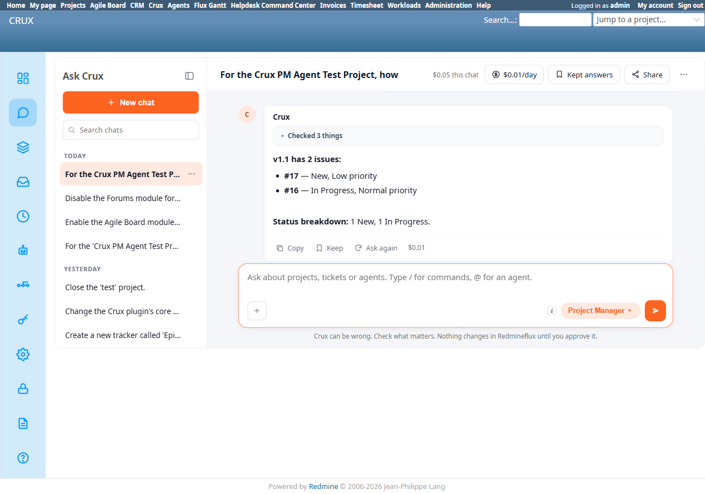
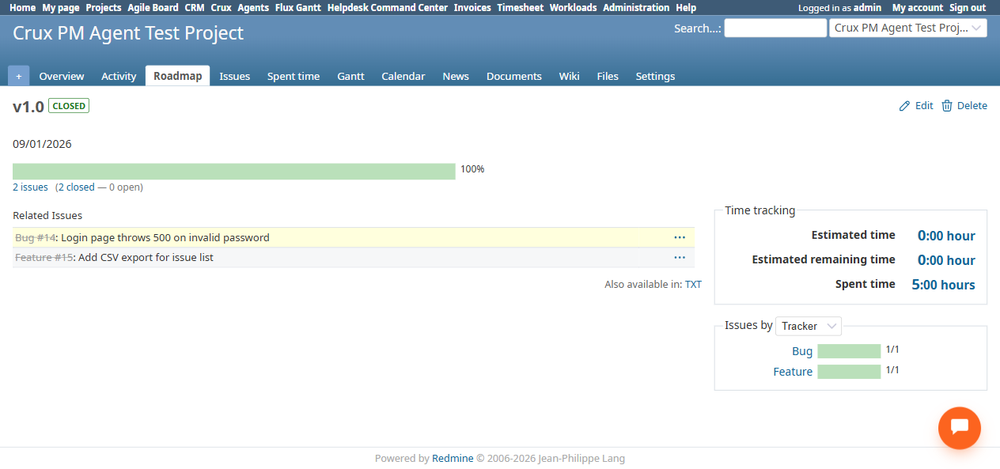
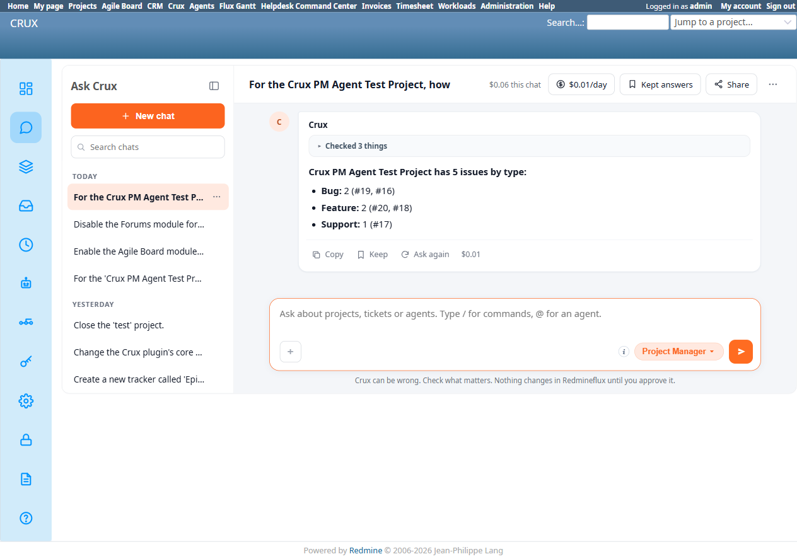

# Bug Report Template

- Bug ID: BUG-CRX-057
- Production Redmine Issue ID:
- Title: Issue-count/listing questions silently default to open-only and under-report whenever Closed issues exist — confirmed on both a per-version count (false "zero issues") and a whole-project type breakdown (silently dropped 2 of 7 issues) — 3/3 reproductions, all missing exactly the Closed issues
- Redmine version: 6.0-bookworm (new local Docker instance)
- Plugin name: redmineflux_crux (Ask Crux chat UI, Project Manager agent)
- Plugin version: 0.62.0
- Environment: Local — `http://localhost:3015` (`C:\crux-redmine`)
- Browser: Chromium (Playwright)
- User role: admin
- Date: 2026-10-10

## Steps to reproduce

1. Seed ground truth on `Crux PM Agent Test Project`: version `v1.0` with exactly 2 issues, both genuinely **Closed** (#14 Bug, #15 Feature — independently verified via the native Roadmap/version page: `/versions/1` shows "2 closed", "closed: 100%", and lists both issues under "Related Issues").
2. Version `v1.1` with exactly 2 issues, **not** closed (#16 Bug — In Progress, #17 Support — New).
3. In a fresh Ask Crux chat (Project Manager agent): "How many issues are in version v1.0, and what's their status breakdown?"
4. In the same chat: "How many issues are in version v1.1, and what's their status breakdown?"
5. Compare both answers against the independently-verified ground truth.

## Expected result

- Step 3 should report 2 issues (both Closed) — or, if the underlying tool only queries open issues by default, the answer should honestly disclose that scope ("0 open issues; closed issues not checked") rather than asserting an absolute "zero issues assigned."
- Step 4 should report 2 issues (1 New, 1 In Progress).

## Actual result

- **Step 3 — FAIL.** Crux replied, in bold: *"v1.0 has zero issues assigned to it."* followed by *"No issues are currently targeted for that version."* This is stated as an absolute, confident fact, not a hedge. It is **false** — v1.0 genuinely has 2 issues, independently confirmed via the native Roadmap page (`/versions/1`): "2 closed", "closed: 100%", both "Bug #14" and "Feature #15" listed under Related Issues.
- **Step 4 — PASS**, using the identical question shape on a different version. Crux correctly replied *"v1.1 has 2 issues:"* listing "#17 — New, Low priority" and "#16 — In Progress, Normal priority", with *"Status breakdown: 1 New, 1 In Progress"* — exactly matching ground truth.
- The only difference between the two versions is that **every issue in v1.0 is Closed**, while v1.1's issues are not. This strongly indicates the underlying issue-listing tool call defaults to an open-only status filter (visible in the Activity trail as "✓ List issues" called twice for the v1.0 query, vs once for v1.1 — suggesting a retry/fallback path specific to the empty-result case), and when that filtered query returns 0 rows, Crux reports it as an unqualified "zero issues assigned" / "no issues are currently targeted" rather than disclosing that closed issues were excluded from the check.
- This is a confident, checkable factual claim that is wrong — a real user planning a release around v1.0 would be told it's completely empty, when it actually contains 2 finished (closed) issues.

## Evidence

### Screenshot

### Console / log

- Exact Crux quote for v1.0: "v1.0 has zero issues assigned to it. No issues are currently targeted for that version." — Activity trail: "Checked 3 things" → ✓ List issues, ✓ List projects, ✓ List issues (called twice).
- Exact Crux quote for v1.1 (correct, for comparison): "v1.1 has 2 issues: #17 — New, Low priority; #16 — In Progress, Normal priority. Status breakdown: 1 New, 1 In Progress." — Activity trail: "Checked 3 things" → ✓✓✓ (single List issues call sufficed).
- Native ground truth (`/versions/1`): "2 closed" progress summary, "closed: 100%", Related Issues table lists Bug #14 and Feature #15.

## 3rd reproduction — whole-project issue-type breakdown (new query shape, same chat)

**Steps:** In the same chat, after the v1.0/v1.1 queries above: "In the Crux PM Agent Test Project, how many tickets are there of each type (Bug, Feature, Support)?"

**Ground truth** (7 issues total, independently seeded and verified): Bug = 3 (#14 Closed, #16 In Progress, #19 New), Feature = 3 (#15 Closed, #18 In Progress, #20 New), Support = 1 (#17 New).

**Actual result — FAIL, same root cause.** Crux replied: *"Crux PM Agent Test Project has 5 issues by type: Bug: 2 (#19, #16), Feature: 2 (#20, #18), Support: 1 (#17)"* — **missing exactly #14 and #15, the project's only two Closed issues.** Total under-reported as 5 instead of 7. This is not an isolated per-version bug — the same silent open-only default affects a plain whole-project type-count question with no version filter involved at all, confirming the root cause is in the shared issue-listing/counting path itself, not something specific to version-scoped queries.

## Duplicate check

- Duplicate found: No — checked `bugs/_duplicates.md` and `bugs/_index.md`. Related in spirit to the already-fixed fabricated-absence pattern (BUG-CRX-026, BUG-CRX-044 — both on different agents claiming "nothing exists" when data was simply inaccessible/unchecked) but a new instance on the Project Manager agent's version/issue-count reporting path, with a clear, reproducible root cause (status filter defaults to open-only, silently, for this specific query shape).
