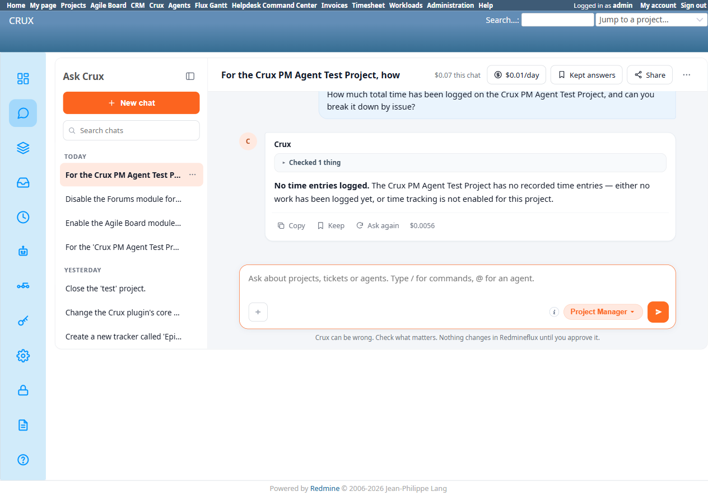
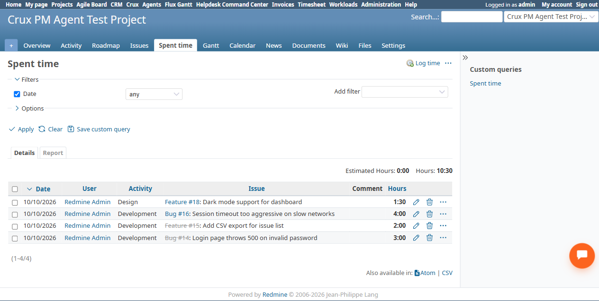

# Bug Report Template

- Bug ID: BUG-CRX-058
- Production Redmine Issue ID:
- Title: "How much time has been logged on this project" falsely claims zero time entries and speculates "time tracking is not enabled" — 4 real time entries totaling 10.5h genuinely exist, spanning both open and closed issues
- Redmine version: 6.0-bookworm (new local Docker instance)
- Plugin name: redmineflux_crux (Ask Crux chat UI, Project Manager agent)
- Plugin version: 0.62.0
- Environment: Local — `http://localhost:3015` (`C:\crux-redmine`)
- Browser: Chromium (Playwright)
- User role: admin
- Date: 2026-10-10

## Steps to reproduce

1. On `Crux PM Agent Test Project`, log real time entries against multiple issues with a mix of statuses: #14 (Closed) — 3h Development, #15 (Closed) — 2h Development, #16 (In Progress) — 4h Development, #18 (In Progress) — 1.5h Design. Total: 10.5h across 4 entries. Independently verified via the native `/projects/crux-pm-agent-test-project/time_entries` page (Details view lists all 4 rows, correct hours each).
2. In Ask Crux (Project Manager agent): "How much total time has been logged on the Crux PM Agent Test Project, and can you break it down by issue?"

## Expected result

- Crux should report the real total (10.5h) broken down across the 4 issues that have logged time, matching the native Spent Time page.

## Actual result

Crux replied, in bold: *"No time entries logged."* followed by *"The Crux PM Agent Test Project has no recorded time entries — either no work has been logged yet, or time tracking is not enabled for this project."*

Both halves of this claim are false:
- Time entries genuinely exist — 4 of them, 10.5h total, independently confirmed via the native UI.
- Time tracking is unambiguously enabled for this project (it's a core Redmine module, already used throughout this session to log the very entries in question).

Notably, the 4 real entries span **both** closed issues (#14, #15 — 5h) **and** non-closed issues (#16, #18 — In Progress, 5.5h). This is a stronger failure than BUG-CRX-057 (which only dropped Closed-issue rows from a count) — here, the tool call found **zero** of either kind. The Activity trail shows only "Checked 1 thing" (a single tool call) before Crux confidently asserted total absence, with no attempt to verify via a second angle (e.g. checking a specific issue's own spent-time field) before speculating about disabled time tracking — a speculation it had no way to actually confirm, and which is itself wrong.

## Evidence

### Screenshot

### Console / log

- Exact Crux quote: "No time entries logged. The Crux PM Agent Test Project has no recorded time entries — either no work has been logged yet, or time tracking is not enabled for this project."
- Activity trail: "Checked 1 thing" — a single tool call, result apparently empty/unparsed, with no retry or second tool attempted before the confident false-absence conclusion.
- Native ground truth (`/projects/crux-pm-agent-test-project/time_entries`): 4 rows — Bug #14 (3:00, Development), Feature #15 (2:00, Development), Bug #16 (4:00, Development), Feature #18 (1:30, Design).

## Duplicate check

- Duplicate found: No — checked `bugs/_duplicates.md` and `bugs/_index.md`. Same fabricated-absence family as BUG-CRX-026/044/057, but a distinct instance: BUG-CRX-057 was a partial under-count (closed issues silently dropped from a count that otherwise worked); this is a total, unqualified false negative (zero found when 10.5h real, mixed-status data exists) on an entirely different data type (time entries, not issues), and compounded by an unfounded, wrong speculation about the feature being disabled.
