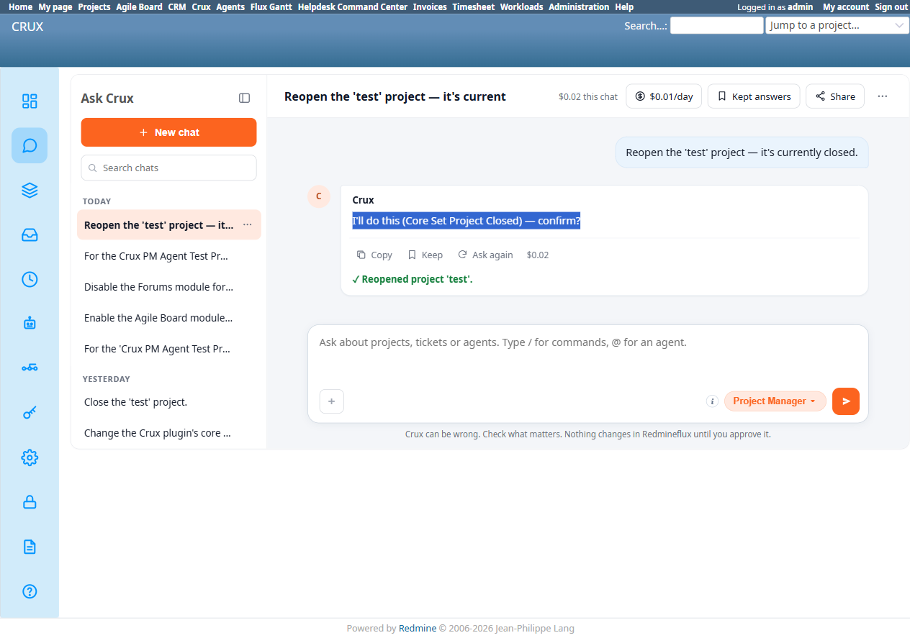

# Bug Report Template

- Bug ID: BUG-CRX-059
- Production Redmine Issue ID:
- Title: Confirm-card headline for Reopen a project says "(Core Set Project Closed)" — identical to the headline for actually closing it — direction only visible in the detail table below, not the headline
- Redmine version: 6.0-bookworm (new local Docker instance)
- Plugin name: redmineflux_crux (Ask Crux chat UI, Project Manager agent)
- Plugin version: 0.62.0
- Environment: Local — `http://localhost:3015` (`C:\crux-redmine`)
- Browser: Chromium (Playwright)
- User role: admin
- Date: 2026-10-10

## Steps to reproduce

1. As admin, in Ask Crux: "Close the 'test' project." → a confirm card appears with headline **"I'll do this (Core Set Project Closed) — confirm?"** and a detail table showing `Project: test` / `Closed: True`. Confirm it.
2. In a fresh chat: "Reopen the 'test' project — it's currently closed." → a confirm card appears with the **exact same headline, word for word**: **"I'll do this (Core Set Project Closed) — confirm?"** — this time with the detail table showing `Project: test` / `Closed: False`.
3. Compare the two headlines side by side.

## Expected result

- The headline itself should make the direction of the action unambiguous at a glance — e.g. "I'll close this project" vs. "I'll reopen this project" — since the bold headline is the first and most prominent thing a user reads, before any detail table.
- At minimum, if the underlying tool is genuinely the same single "set closed flag" operation for both directions, the headline's parenthetical tool-name label should not use a word ("Closed") that, read on its own, implies the opposite of what a Reopen action actually does.

## Actual result

The confirm-card headline is **identical** for both the close and the reopen action: **"I'll do this (Core Set Project Closed) — confirm?"** The only place the actual direction is visible is the detail table underneath (`Closed: True` vs `Closed: False`). A user who reads only the bold headline — the natural first thing to read, and the only part visible if the table is scrolled out of view or glanced past quickly — would have no way to tell whether they are about to close or reopen the project; worse, for the Reopen case, the headline's own wording ("...Project Closed") reads as if it's about to close the project, the opposite of the real effect.

This is not a fabrication or a false-success issue — the table detail is honest and correct both times, and the action genuinely executes as shown in the table. It is a message-clarity defect: the tool's static display name ("Core Set Project Closed") is being reused unconditionally regardless of the actual boolean direction of the parameter it's setting.

## Evidence

### Screenshot

### Console / log

- Close-action headline (captured via accessibility snapshot, TC-CRX-198): "I'll do this (Core Set Project Closed) — confirm?" — table `Project: test` / `Closed: True`.
- Reopen-action headline (captured via accessibility snapshot, TC-CRX-204): "I'll do this (Core Set Project Closed) — confirm?" — table `Project: test` / `Closed: False`. Word-for-word identical to the close-action headline.

## Duplicate check

- Duplicate found: No — checked `bugs/_duplicates.md` and `bugs/_index.md`. Ties into the same parked "message clarity for non-technical users" theme already raised in `CRUX_HANDOFF.md` (e.g. TC-CRX-193/194's generic-hedge findings), but this is the first concrete instance of a confirm-card *headline* (not a refusal message) being direction-ambiguous for a toggle-style action.
