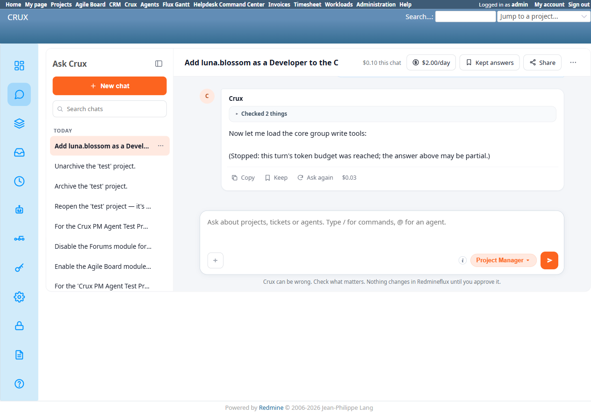

# Bug Report Template

- Bug ID: BUG-CRX-060
- Production Redmine Issue ID:
- Title: "Add a project member" request never reaches a confirm card — stalls 2/2 times mid tool-discovery, stopped by the turn's own token budget before `create_project_membership` is ever found
- Redmine version: 6.0-bookworm (new local Docker instance)
- Plugin name: redmineflux_crux (Ask Crux chat UI, Project Manager agent)
- Plugin version: 0.62.0
- Environment: Local — `http://localhost:3015` (`C:\crux-redmine`)
- Browser: Chromium (Playwright)
- User role: admin
- Date: 2026-10-10

## Steps to reproduce

1. As admin, in a fresh Ask Crux chat (Project Manager agent): "Add luna.blossom as a Developer to the Crux PM Agent Test Project."
2. Observe the reply never reaches a proposal/confirm card — it cuts off mid-sentence with "(Stopped: this turn's token budget was reached; the answer above may be partial.)"
3. Click "Ask again" on the same message.
4. Observe the exact same stall again, on a different sentence this time, but the same outcome: no confirm card, no Confirm/Cancel buttons, nothing actionable produced.

## Expected result

- A genuine confirm card naming a real member-creation tool (e.g. `Core Create Project Membership`), with a detail table (project, user, role) and real Confirm/Cancel buttons — consistent with every other successful write this session (Close/Reopen/Archive/Unarchive all produced a clean confirm card on the first try).
- If the request genuinely cannot be fulfilled, an honest, clear refusal message — not a silent mid-sentence cutoff.

## Actual result

Both attempts (2/2) stall identically, never reaching a confirm card or any actionable output:

- **Attempt 1:** "Great — the **core** group has 37 write tools. Let me load them to find the `create_project_membership` tool:(Stopped: this turn's token budget was reached; the answer above may be partial.)"
- **Attempt 2 ("Ask again"):** "Now let me load the **core** group write tools:(Stopped: this turn's token budget was reached; the answer above may be partial.)"

Both turns show `tool_calls=7` in the crux-core log (`docker logs crux-redmine6-crux-core-1`), each making 6 OpenRouter LLM round-trips before the server-side turn budget cuts it off — the agent is burning its entire per-turn budget discovering which of the "core" group's 37 write tools is the right one, and never gets far enough to actually call `create_project_membership` or propose anything. Confirmed via log: both turns end `outcome=success` at the HTTP layer (the API call itself didn't error) but the chat content is genuinely incomplete, not a fabricated success — no write was attempted, and the project's Members tab independently shows "No data" both before and after (verified via native UI, `/projects/crux-pm-agent-test-project/settings/members`).

This makes "add a member" via chat **completely non-functional** for this project — not a false-success or false-failure, but a dead end: the user gets a half-sentence and a token-budget notice with no way to proceed, no confirm card to act on, and no clear statement that the action failed or needs to be retried differently.

## Evidence

### Screenshot

### Console / log

- crux-core (`docker logs crux-redmine6-crux-core-1`), attempt 1: `chat turn agent=project-manager ... tokens_in=159615 tokens_out=662 tool_calls=7 outcome=success` (19.5s latency, 6 LLM round-trips).
- crux-core, attempt 2 (Ask again): `chat turn agent=project-manager ... tokens_in=159865 tokens_out=585 tool_calls=7 outcome=success` (14.0s latency, 6 LLM round-trips).
- Both calls' tool trace shows only `redmineflux_core_list_projects` and `redmineflux_core_list_users` actually executing — never reaching a membership-creation tool call before the budget cutoff.

## Duplicate check

- Duplicate found: No — checked `bugs/_duplicates.md` and `bugs/_index.md`. Not the same as the cost/day-level spend-reminder issue (BUG-CRX-053, which is about a *daily* spend threshold never firing) — this is a *per-turn* token-budget ceiling being hit during tool discovery, a different mechanism and a different, more severe symptom (the action never completes at all, regardless of cost). Also distinct from the fabricated-confirm family (BUG-CRX-020/056) — those produce a fake confirm card with no real buttons; this produces no confirm card of any kind, fake or real, and visibly tells the user it was cut off rather than pretending to have an answer.
