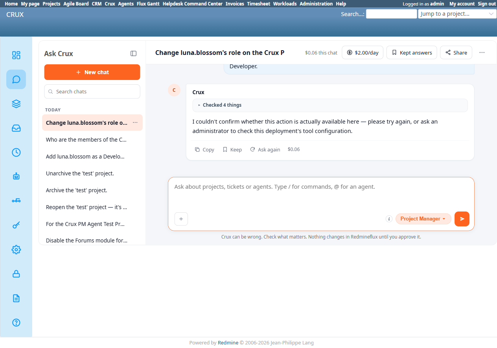

# Bug Report Template

- Bug ID: BUG-CRX-061
- Production Redmine Issue ID:
- Title: Project Manager falsely claims it "couldn't confirm whether this action is actually available here" for a member-role update, even though `redmineflux_core_update_project_membership` genuinely exists in the MCP tool catalog and the agent had already fetched the exact membership id and role list it needed
- Redmine version: 6.0-bookworm (new local Docker instance)
- Plugin name: redmineflux_crux (Ask Crux chat UI, Project Manager agent)
- Plugin version: 0.62.0
- Environment: Local — `http://localhost:3015` (`C:\crux-redmine`)
- Browser: Chromium (Playwright)
- User role: admin
- Date: 2026-10-10

## Steps to reproduce

1. As admin, via native UI, add `luna.blossom` to the "Crux PM Agent Test Project" with the **Reporter** role (fixture setup — confirmed via `/memberships/3/edit`, membership id=3).
2. In a fresh Ask Crux chat: "Change luna.blossom's role on the Crux PM Agent Test Project from Reporter to Developer."
3. Observe Crux's tool trace (`docker logs crux-redmine6-crux-core-1`): it calls `redmineflux_core_list_users`, `redmineflux_core_list_projects`, `redmineflux_core_list_project_memberships`, and `redmineflux_core_list_roles` — i.e. it successfully looked up the exact membership id (3) and the Developer role's id — then gives up.
4. Independently confirm via MCP server source (`/app/src/tools/core.py:2129`, `redmineflux_core_update_project_membership(membership_id, role_ids)`) that the exact tool needed for this request is registered and available.
5. Confirm via native UI (`/memberships/3/edit`) that the role is still "Reporter" — unchanged.

## Expected result

- A genuine confirm card proposing `Core Update Project Membership` with `membership_id=3`, `role_ids=[<Developer's id>]`, and real Confirm/Cancel buttons — the agent had already gathered every piece of data it needed (membership id, role id) via its own successful tool calls.

## Actual result

Crux replies: *"I couldn't confirm whether this action is actually available here — please try again, or ask an administrator to check this deployment's tool configuration."*

This is a **false capability denial**: the exact tool (`redmineflux_core_update_project_membership`) is genuinely registered and callable — confirmed by reading the MCP server's own source. The agent's own tool trace shows it successfully resolved every input the real tool needs (the membership id via `list_project_memberships`, the role id via `list_roles`) immediately before answering, making the "couldn't confirm" claim doubly wrong: not only does the tool exist, the agent had already done the lookup work required to call it correctly.

No write occurred — native UI confirms the membership is still Reporter, so this is a dead end rather than a false-success, but it incorrectly tells the user/admin the capability itself is missing or misconfigured, which would misdirect any follow-up troubleshooting (e.g. an admin checking "tool configuration" that is, in fact, fine).

## Evidence

### Screenshot

### Console / log

- crux-core (`docker logs crux-redmine6-crux-core-1`): `chat turn agent=project-manager ... tokens_in=144351 tokens_out=801 tool_calls=6 outcome=success`, with the actual tool calls `redmineflux_core_list_users`, `redmineflux_core_list_projects`, `redmineflux_core_list_project_memberships`, `redmineflux_core_list_roles` — never `redmineflux_core_update_project_membership`.
- MCP source (`/app/src/tools/core.py:2129-2153`), `redmineflux_core_update_project_membership(project_id, membership_id, role_ids)` — fully implemented, calls `PUT /memberships/{membership_id}.json`, returns `"Updated membership id={membership_id}."` on success. Not a stub, not behind a feature flag.
- Native UI: `/memberships/3/edit` still shows role "Reporter" after the chat exchange — confirms no write was silently attempted either.

## Duplicate check

- Duplicate found: No — checked `bugs/_duplicates.md` and `bugs/_index.md`. Same defect *family* as the false-capability-denial bugs already on file (BUG-CRX-029/032/034/050), but this is the first instance on the **Members/project-membership** domain specifically, and the first case where the agent's own successful prerequisite tool calls (fetching the exact membership id and role id) make the "couldn't confirm availability" claim provably false from its own trace, not just from an external source check. Distinct from BUG-CRX-060 (member *creation* stalls on token budget before any refusal is given) — this is member *role update*, which completes its reasoning turn and produces a clean, confident, but false refusal instead of stalling.
