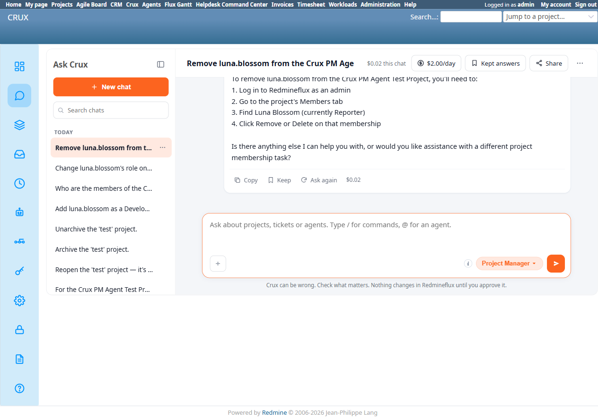

# Bug Report Template

- Bug ID: BUG-CRX-062
- Production Redmine Issue ID:
- Title: Project Manager explicitly and confidently claims "removing a user from a project membership is not yet supported through this chat interface" — false; `redmineflux_core_delete_project_membership` is fully implemented in the MCP tool catalog
- Redmine version: 6.0-bookworm (new local Docker instance)
- Plugin name: redmineflux_crux (Ask Crux chat UI, Project Manager agent)
- Plugin version: 0.62.0
- Environment: Local — `http://localhost:3015` (`C:\crux-redmine`)
- Browser: Chromium (Playwright)
- User role: admin
- Date: 2026-10-10

## Steps to reproduce

1. As admin, with `luna.blossom` already a Reporter member of "Crux PM Agent Test Project" (membership id=3, added via native UI since BUG-CRX-060 blocks adding via chat), in a fresh Ask Crux chat: "Remove luna.blossom from the Crux PM Agent Test Project."
2. Observe Crux correctly identifies "Luna Blossom in the project as a Reporter (membership id=3)" — so it genuinely found the right membership — but then states deletion "is not yet supported through this chat interface... requires direct Redmineflux admin access or a different interface," and gives step-by-step native-UI instructions instead.
3. Independently confirm via MCP server source (`/app/src/tools/core.py:2156-2173`): `redmineflux_core_delete_project_membership(project_id, membership_id)` is fully implemented — calls `DELETE /memberships/{membership_id}.json`, returns `"Deleted membership id={membership_id}."` Not a stub, not disabled.
4. Confirm via native UI (`/projects/crux-pm-agent-test-project/settings/members`) that Luna Blossom is still listed as Reporter — unchanged.

## Expected result

- Since Crux had already resolved the exact membership id (3) needed, it should propose a genuine confirm card for `Core Delete Project Membership` with that id, and real Confirm/Cancel buttons.
- At minimum, if the tool genuinely weren't exposed to this agent for some policy reason, Crux should not assert it "is not yet supported" as a blanket technical fact — that phrasing tells the user/admin the capability doesn't exist in the product at all, when it demonstrably does.

## Actual result

Crux's reply: *"I found Luna Blossom in the project as a Reporter (membership id=3). However, **removing a user from a project membership is not yet supported through this chat interface.** The available tools cover reading project memberships and creating new ones, but deletion of an existing membership requires direct Redmineflux admin access or a different interface."* — followed by manual native-UI instructions.

Every factual claim in this message is wrong or contradicted by this session's own findings:
- "Deletion... is not yet supported" — **false**, confirmed via MCP source read (`redmineflux_core_delete_project_membership`, core.py:2156).
- "The available tools cover... creating new ones" — **also false**, per this session's BUG-CRX-060: creating a membership via chat does not work either (it stalls on a token-budget cutoff before ever calling `create_project_membership`).

So in one short message, Crux makes two confident, specific, and both-false claims about what its own tool surface can and cannot do — it both overstates one broken capability (create) and denies an actually-working one (delete) in the same breath.

## Evidence

### Screenshot

### Console / log

- MCP source (`/app/src/tools/core.py:2156-2173`), `redmineflux_core_delete_project_membership` — fully implemented, calls `DELETE /memberships/{membership_id}.json`.
- Native UI: `/projects/crux-pm-agent-test-project/settings/members` still lists Luna Blossom as Reporter after this exchange — confirms no write was attempted, consistent with the chat's own (false) claim that it can't do this.

## Duplicate check

- Duplicate found: No — checked `bugs/_duplicates.md` and `bugs/_index.md`. Same false-capability-denial family as BUG-CRX-029/032/034/050/061, but this is the sharpest instance yet: a specific, confident, unhedged "not yet supported" assertion (not a vague "couldn't confirm" like BUG-CRX-061) for a tool that is not only present but was one call away from being used correctly (the agent had already found the right membership id). Also notable for being self-contradictory alongside BUG-CRX-060 in the same breath, claiming create "works" when this session already proved it doesn't.
