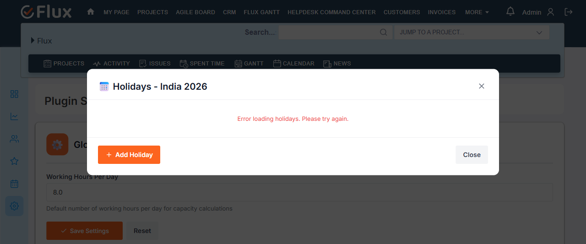

# Bug Report

- Bug ID: BUG-RFM-001
- Title: Holidays modal shows "Error loading holidays" for non-active holiday scheme
- Redmine version: Flux (dev-flux.zehntech.com)
- Plugin name: redmineflux_mcp (holiday management module)
- Plugin version: current
- Environment: dev-flux.zehntech.com
- Browser: Chromium (Playwright)
- User role: Admin
- Date: 2026-06-11
- **Status: CLOSED — Fixed (verified 2026-06-12)**

## Steps to reproduce

1. Using MCP, create a holiday scheme named "India 2026": `holiday_scheme_create(name="India 2026")` → scheme #9 created.
2. Using MCP, add a holiday to the scheme: `holiday_create(scheme_id=9, name="Diwali", date="2026-11-10")` → holiday #24 created.
3. Verify via MCP `holiday_scheme_show(scheme_id=9)` → returns `#24 2026-11-10 | Diwali | national` ✓
4. Navigate to `/rf_settings` in the browser.
5. Locate the "India 2026" row in the Holiday Management table (shows "1 holiday").
6. Click the "Holidays" button for the "India 2026" row.
7. Observe the modal that opens.

## Expected result

- The "Holidays - India 2026" modal opens and displays the list of holidays:
  - Diwali — 10-Nov-2026

## Actual result (at time of filing)

- The modal opened with title "📅 Holidays - India 2026" but showed:
  **"Error loading holidays. Please try again."**
- No holidays were displayed.

## Evidence

### Holidays modal showing error for India 2026

## Retest — 2026-06-12 — FIXED

- Navigated to `/rf_settings` as admin.
- Clicked "Holidays" button for "India 2026" (non-active, 3 holidays).
- Modal opened as "📅 Holidays - India 2026" and displayed all 3 holidays:
  - Republic Day — Jan 26, 2026 — National Holiday
  - Independence Day — Aug 15, 2026 — National Holiday
  - Gandhi Jayanti — Oct 02, 2026 — National Holiday
- **Result: FIXED** — UI modal now correctly renders holidays for non-active schemes.

## Duplicate check

- Duplicate found: No
- Existing bug reference: N/A
