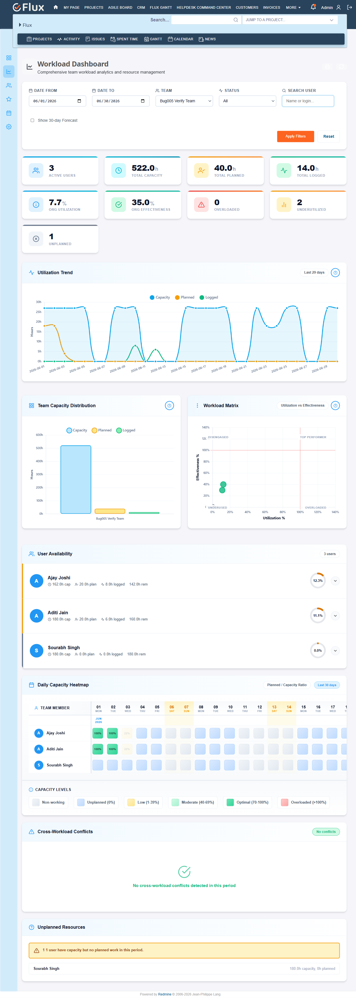

# Bug Report

- Bug ID: BUG-RFM-005
- Title: `dashboard` MCP tool returns incorrect capacity, logged hours, and derived metrics vs UI
- Redmine version: Flux (dev-flux.zehntech.com)
- Plugin name: redmineflux_mcp (workload dashboard module)
- Plugin version: current
- Environment: dev-flux.zehntech.com
- Browser: N/A (MCP tool + Playwright UI)
- User role: Admin
- Date: 2026-06-12

## Steps to reproduce

1. Call MCP `dashboard` with `team_id=27`, `from_date="2026-06-01"`, `to_date="2026-06-30"`.
2. Navigate to Playwright UI: `/workload_dashboard?date_from=2026-06-01&date_to=2026-06-30&team_id=27`.
3. Compare metric values between MCP response and UI.

## Expected result

All numeric metrics returned by MCP `dashboard` should match the values displayed in the Playwright UI for the same parameters (team_id=27, 2026-06-01 → 2026-06-30).

## Actual result

Multiple metric discrepancies between MCP and UI:

| Metric | MCP | UI | Match |
|--------|-----|----|-------|
| Active Users | 7 | 7 | ✓ |
| Total Capacity | **1242.0h** | **993.6h** | ✗ |
| Total Planned | 110.0h | 110.0h | ✓ |
| Total Logged | **0.0h** | **109.5h** | ✗ |
| Utilization | **8.9%** | **11.1%** | ✗ |
| Effectiveness | **0.0%** | **99.5%** | ✗ |
| Overloaded | 0 | 0 | ✓ |
| Underutilized | **2** | **1** | ✗ |
| Unplanned | 5 | 5 | ✓ |

Key observations:
- **Total Logged (0h vs 109.5h)**: MCP returns 0 logged hours. The UI shows 109.5h logged against Automation Team issues for this period. MCP appears to not be fetching time entries for the dashboard.
- **Total Capacity (1242h vs 993.6h)**: MCP calculates 1242h (177.4h/user avg), UI shows 993.6h (141.9h/user avg). The ~248h gap (35.5h/user) suggests different working day or hours-per-day assumptions between MCP and UI.
- **Utilization and Effectiveness** discrepancies are derived from the above two root causes.

## Evidence

MCP response (summary):
```
Active Users: 7 | Capacity: 1242.0h | Planned: 110.0h | Logged: 0.0h
Utilization: 8.9% | Effectiveness: 0.0% | Underutilized: 2 | Unplanned: 5
Ajay Joshi: Planned 70.0h / 162.0h avail
Aditi Jain: Planned 40.0h / 180.0h avail
```

Playwright UI (team_id=27, 2026-06-01→2026-06-30):
```
Active Users: 7 | Capacity: 993.6h | Planned: 110.0h | Logged: 109.5h
Utilization: 11.1% | Effectiveness: 99.5% | Underutilized: 1 | Unplanned: 5
```

## Affected TCs

- TC-RFM-077: FAIL — dashboard data consistency check fails on 5 metrics

## Duplicate check

- Duplicate found: No
- Related bugs: None

---

## Retest — 2026-06-16

**Result: PARTIAL FIX — still open**

MCP `dashboard(team_id=27, from_date="2026-06-01", to_date="2026-06-30")` vs UI `/workload_dashboard?date_from=2026-06-01&date_to=2026-06-30&team_id=27`:

| Metric | MCP | UI | Match |
|--------|-----|----|-------|
| Active Users | 10 | 10 | ✓ |
| Total Capacity | **1737.0h** | **1737.0h** | ✓ **FIXED** |
| Total Planned | 868.0h | 868.0h | ✓ |
| **Total Logged** | **0.0h** | **178.6h** | **✗ STILL WRONG** |
| Utilization | 50.0% | 50.0% | ✓ |
| **Effectiveness** | **0.0%** | **20.6%** | **✗ STILL WRONG** |
| Overloaded | 0 | 0 | ✓ |
| **Underutilized** | **10** | **1** | **✗ STILL WRONG** |
| Unplanned | 0 | 0 | ✓ |

**What was fixed:** Total Capacity calculation now matches UI (previously 1242h MCP vs 993.6h UI — that discrepancy is gone; both now show 1737h).

**What remains broken:** Total Logged is still 0.0h in MCP while UI shows 178.6h. This causes Effectiveness (0.0% vs 20.6%) and Underutilized (10 vs 1) to be wrong. Root cause: MCP dashboard does not fetch time entries when computing the dashboard response.

---

## Retest — 2026-06-17

**Result: PASS — FIXED**

**Test setup:**
- Team: Bug005 Verify Team (#51), 3 members (Ajay Joshi, Aditi Jain, Sourabh Singh)
- Workload: Bug005 Verify Workload (#30), 2026-06-01 → 2026-06-30
- Issues: #115352 (Ajay, 20h planned), #115353 (Aditi, 20h planned)
- Time entries logged: 8h for Ajay on 2026-06-10, 6h for Aditi on 2026-06-12

MCP `dashboard(team_id=51, date_from="2026-06-01", date_to="2026-06-30")` vs UI `/workload_dashboard?date_from=2026-06-01&date_to=2026-06-30&team_id=51`:

| Metric | MCP | UI | Match |
|--------|-----|----|-------|
| Active Users | 3 | 3 | ✓ |
| Total Capacity | 522.0h | 522.0h | ✓ |
| Total Planned | 40.0h | 40.0h | ✓ |
| Total Logged | 14.0h | 14.0h | ✓ |
| Utilization | 7.7% | 7.7% | ✓ |
| Effectiveness | 35.0% | 35.0% | ✓ |
| Overloaded | 0 | 0 | ✓ |
| Underutilized | 2 | 2 | ✓ |
| Unplanned | 1 | 1 | ✓ |

All 9 metrics match. MCP now correctly fetches and reports logged hours (14.0h = 8h Ajay + 6h Aditi) and all derived metrics (Effectiveness, Underutilized) are accurate.

**Evidence:**



---

## Controlled Retest — 2026-06-17 (workload #30, 40h)

**Result: PASS — FIXED (confirmed, 3 consecutive calls)**

**Test setup:**
- Team: Bug005 Verify Team (#51), 3 members (Ajay Joshi, Aditi Jain, Sourabh Singh)
- Workload: Bug005 Verify Workload (#30), 2026-06-01 → 2026-06-30
- Issues: #115352 (Ajay Joshi, 20h planned), #115353 (Aditi Jain, 20h planned)
- Time entries logged: Ajay 10h on 2026-06-02 + 10h on 2026-06-03 = 20h; Aditi 10h on 2026-06-02 + 10h on 2026-06-03 = 20h (total 40h logged, matching planned)
- UI dashboard (team #51, June 1-30): 522h capacity, 40h planned, 40h logged, 100% effectiveness

MCP `dashboard(team_id=51, date_from="2026-06-01", date_to="2026-06-30")` — 3 consecutive calls, all identical:

| Metric | MCP | UI | Match |
|--------|-----|----|-------|
| Active Users | 3 | 3 | ✓ |
| Total Capacity | 522.0h | 522.0h | ✓ |
| Total Planned | 40.0h | 40.0h | ✓ |
| Total Logged | 40.0h | 40.0h | ✓ |
| Utilization | 7.7% | 7.7% | ✓ |
| Effectiveness | 100.0% | 100.0% | ✓ |
| Overloaded Users | 0 | 0 | ✓ |
| Underutilized Users | 2 | 2 | ✓ |
| Unplanned Users | 1 | 1 | ✓ |

All 9 metrics match across all 3 calls. Result is deterministic. BUG-RFM-005 confirmed FIXED.
