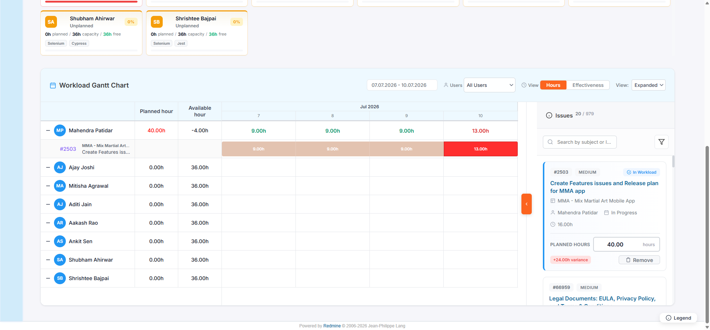
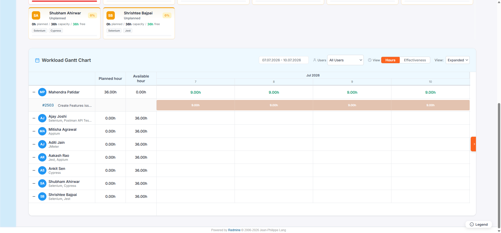

# Open Bugs — Redmineflux MCP & Workload Plugin

**Reported by:** Sourabh Singh  
**Environment:** dev-flux.zehntech.com (RedmineFlux MCP Server v0.2.2, Beta)  
**Plugin:** redmineflux_mcp / Workload  
**Total Open:** 6  

---

## Summary Table

| # | Bug ID | Title | Severity | Module | Status |
|---|--------|-------|----------|--------|--------|
| 1 | BUG-RFM-002 | `team_data` misreports HTTP 403 as "Server error (500)" for deleted team | Medium | Team Management | Open |
| 2 | BUG-RFM-004 | `workload_show` misreports HTTP 404 as "Server error (500)" for deleted workload | Medium | Workload CRUD | Open |
| 3 | BUG-RFM-005 | `dashboard` returns wrong capacity, logged hours, and derived metrics vs UI | High | Workload Dashboard | Open |
| 4 | BUG-RFM-009 | Team page and `team_data` do not show created-by author name | Low | Team Management | Open |
| 5 | BUG-RFM-010 | Disabling "Allow workload overload" silently removes overload hours from Gantt | High | Workload Settings | Open |
| 6 | BUG-RFM-011 | Allocation split fails with MySQL duplicate-key error (error reporting improved) | High | Workload Allocations | Open |

---

## Bug 1 — BUG-RFM-002

**Title:** `team_data` misreports HTTP 403 as "Server error (500)" for deleted team ID  
**Severity:** Medium  
**Module:** Team Management — MCP error handler  
**TC Affected:** TC-RFM-107  

### Steps to Reproduce
1. Create a team via MCP: `team_create(name="Delete Test Team")` → team created (e.g. #32).
2. Delete the team: `team_delete(team_id=32)` → responds "Team deleted successfully".
3. Read the deleted team: `team_data(team_id=32)`.

### Expected Result
MCP returns a clear "not found" or 404-equivalent error.

### Actual Result
MCP returns `Server error (500): Internal Server Error`.

**Root Cause:** The MCP error-handler wraps all non-2xx HTTP responses as 500. The backend correctly returns 403; the bug is in the MCP translation layer.

---

## Bug 2 — BUG-RFM-004

**Title:** `workload_show` misreports HTTP 404 as "Server error (500)" for deleted workload ID  
**Severity:** Medium  
**Module:** Workload CRUD — MCP error handler  
**TC Affected:** TC-RFM-129  

### Steps to Reproduce
1. Create a workload via MCP: `workload_create(team_id=27, name="Delete Test", start_date="2026-07-01", end_date="2026-07-31")` → workload created.
2. Delete it: `workload_delete(workload_id=<id>)` → responds "Workload deleted".
3. Read it: `workload_show(workload_id=<id>)`.

### Expected Result
MCP returns a clear "not found" or 404-equivalent error.

### Actual Result
MCP returns `Server error (500): Internal Server Error`.

**Root Cause:** Same MCP error-handler issue as BUG-RFM-002 — backend returns 404 correctly, MCP wraps it as 500.

---

## Bug 3 — BUG-RFM-005

**Title:** `dashboard` MCP tool returns incorrect capacity, logged hours, and derived metrics vs UI  
**Severity:** High  
**Module:** Workload Dashboard  
**TC Affected:** TC-RFM-155  

### Steps to Reproduce
1. Call MCP `dashboard(team_id=27, from_date="2026-06-01", to_date="2026-06-30")`.
2. Open UI at `/workload_dashboard?date_from=2026-06-01&date_to=2026-06-30&team_id=27`.
3. Compare values.

### Expected Result
All numeric metrics match between MCP and UI for the same parameters.

### Actual Result (2026-06-12 original)

| Metric | MCP | UI | Match |
|--------|-----|----|-------|
| Active Users | 7 | 7 | ✓ |
| Total Capacity | **1242.0h** | **993.6h** | ✗ |
| Total Planned | 110.0h | 110.0h | ✓ |
| Total Logged | **0.0h** | **109.5h** | ✗ |
| Utilization | **8.9%** | **11.1%** | ✗ |
| Effectiveness | **0.0%** | **99.5%** | ✗ |
| Overloaded | 0 | 0 | ✓ |
| Underutilized | **2** | **1** | ✗ |
| Unplanned | 5 | 5 | ✓ |

### Retest 2026-06-16 — PARTIAL FIX

| Metric | MCP | UI | Match |
|--------|-----|----|-------|
| Active Users | 10 | 10 | ✓ |
| Total Capacity | **1737.0h** | **1737.0h** | ✓ **FIXED** |
| Total Planned | 868.0h | 868.0h | ✓ |
| **Total Logged** | **0.0h** | **178.6h** | **✗ STILL WRONG** |
| Utilization | 50.0% | 50.0% | ✓ |
| **Effectiveness** | **0.0%** | **20.6%** | **✗ STILL WRONG** |
| Overloaded | 0 | 0 | ✓ |
| **Underutilized** | **10** | **1** | **✗ STILL WRONG** |
| Unplanned | 0 | 0 | ✓ |

Capacity calculation is now correct. Logged hours (and derived Effectiveness/Underutilized) still wrong.

---

## Bug 4 — BUG-RFM-009

**Title:** Team page and `team_data` do not show created-by author name  
**Severity:** Low  
**Module:** Team Management  

### Steps to Reproduce
1. Create a team: `team_create(name="Bug-Check Author Team")`.
2. Call `team_data(team_id=<id>)`.
3. Navigate to `/rf_teams/<id>` in the browser.

### Expected Result
`team_data` includes a `created_by` or `author` field; the UI team page displays "Created by" alongside "Created on".

### Actual Result
MCP response: `Team: Bug-Check Author Team (#39) / Members (0): / Workloads (0):` — no author field.  
UI shows: `"Created on: 12.06.2026 12:36"` — no "Created by" visible. The Workloads list page has a "Created by" column that works correctly; the Team detail page omits it.

---

## Bug 5 — BUG-RFM-010

**Title:** Disabling "Allow workload overload" silently removes overload hours from Gantt and creates data inconsistency  
**Severity:** High  
**Module:** Workload Settings / Gantt  

### Steps to Reproduce
1. Confirm "Allow workload overload on drag & drop" is **ENABLED** in Settings.
2. Create a workload (e.g. Jul 7–10, 36h capacity per member).
3. Add an issue with **40h** planned hours → member shows Overbooked 111%, Gantt shows 9/9/9/13h.
4. Go to Settings → disable "Allow workload overload" → Save Settings.
5. Return to the workload.

### Expected Result
Existing over-capacity allocations are preserved **OR** admin receives a warning before the setting change retroactively modifies saved data.

### Actual Result
- Gantt silently recalculates day-4 from 13h → 9h (40h total drops to 36h — **4 planned hours lost with no notification**).
- Capacity card still shows 40h planned / 111% — **inconsistent with Gantt which now shows 36h**.
- Only message shown: "Settings updated successfully".





---

## Bug 6 — BUG-RFM-011

**Title:** Allocation split operation fails with MySQL duplicate-key error (error reporting improved)
**Severity:** High  
**Module:** Workload Allocations  

### Steps to Reproduce
1. Open any existing workload that has at least one allocation (issue assigned to a user with planned hours).
2. Invoke the split-allocation operation on any allocation, supplying `split_hours` less than the total planned hours.
3. Observe the response.

### Expected Result
The allocation is divided into two parts: the first receives `split_hours`, the second receives the remainder. Both remain on the timeline for the same issue and user.

### Actual Result (2026-06-12 original)
The operation threw a raw database error:

```
Mysql2::Error: Duplicate entry '29-1788' for key 'rf_workload_allocations.idx_rf_wla_issue_user_parent_unique'
Mysql2::Error: Duplicate entry '1782-5' for key 'rf_workload_allocations.index_rf_workload_allocations_on_user_and_position'
```

**Root Cause:** The split logic attempts to insert a second allocation row for the same `(issue, user, parent)` combination, violating two unique constraints. The feature's intent directly contradicts the current schema — split cannot succeed without a DB migration.

### Retest 2026-06-16 — STILL OPEN (error reporting improved)

Tested on workload #27 (Automation Team), allocation_id=69, split_hours=5:

```
Validation error: Allocation split failed: the database schema has a unique constraint
that prevents splitting this allocation. A database migration is required to enable
split for the same issue and user.
Raw detail: Mysql2::Error: Duplicate entry '62-1831'
```

**What improved:** Error is now wrapped in "Validation error:" with a human-readable explanation. Key/table names are no longer leaked.

**What remains broken:** Core split failure unchanged (DB schema migration required). `Raw detail: Mysql2::Error: Duplicate entry '62-1831'` still exposes raw DB error values to the API caller.

### Retest 2026-06-17 — STILL OPEN (no change)

Tested on workload #32 (Bug005 Verify Team), allocation_id=79 (issue #10292, Ajay Joshi, 22.0h), split_hours=10:

```
Validation error: Allocation split failed: the database schema has a unique constraint
that prevents splitting this allocation. A database migration is required to enable
split for the same issue and user. Raw detail: Mysql2::Error: Duplicate entry '66-1867'
```

Identical to 2026-06-16 result. No fix deployed. Core failure and raw DB detail leak both unchanged.

---

### Retest 2026-06-18 — PASS (FIXED)

**Environment:** Local Docker (localhost:3006, MCP v0.2.2 ses_91426264e79b)

Workload #3 "Workload 1" (Team 1), allocation_id=6, split_hours=5:

```
Allocation split successfully
Insert position: 2
```

No MySQL error. Split completed without a database constraint violation. The DB schema migration (unique constraint change on `rf_workload_allocations`) has been applied.

**Result: FIXED** — allocation split now works correctly.

*Last updated: 2026-06-18*
