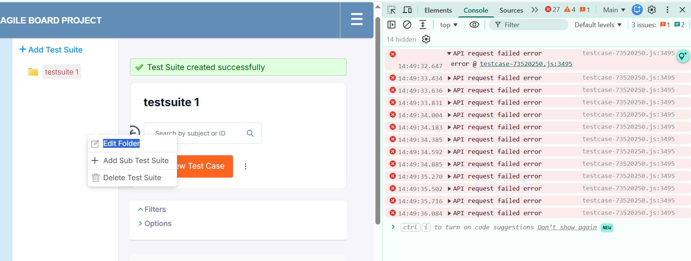
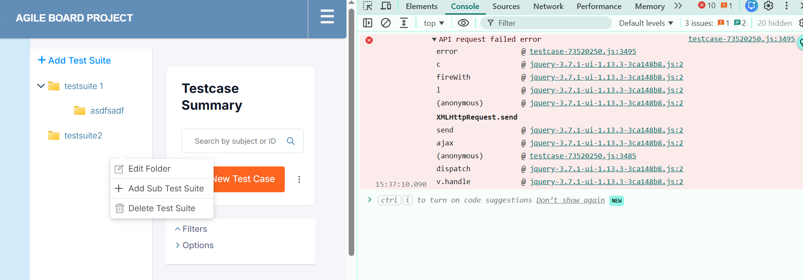
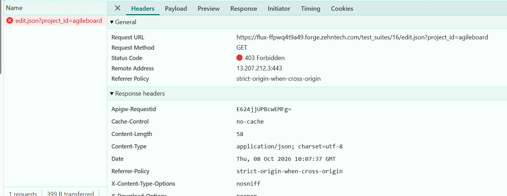

# Bug Report Template

> **CLOSED — 2026-10-08.** Production #122902 (https://flux.zehntech.com/issues/122902) is **Done**, 100% done.
> Retested on a different Forge instance (`flux-fvqoa5yw149.forge.zehntech.com`) — see "Retest" section below.

- Bug ID: BUG-TCM-062
- Production Redmine Issue ID: #122902 (reported 2026-10-08, assigned Vaishnavi Bhawsar, target version "Testcase Management plugin Release 7.1.0", Priority High, Defect Severity High-severity, category Testcase Management Plugin)
- Title: "Edit Folder" (Edit Test Suite) and Edit Requirement fail with 403 Forbidden on their `.json` AJAX routes — modal never loads, console floods with repeated "API request failed" errors
- Redmine version: Unknown — pending check via Administration > Information on this instance (not previously-documented QA instance)
- Plugin name: Redmineflux Testcase Management
- Plugin version: Unknown — pending check via Administration > Plugins
- Environment: Forge (cloud-hosted, rotates per run) — `https://flux-ffpwq4t9a49.forge.zehntech.com/`, project "Agile Board Project" (identifier `agileboard`). Response headers show an `Apigw-Requestid`, indicating this deployment sits behind an API Gateway in front of Redmine.
- Browser: Chrome (DevTools shown in evidence)
- User role: Admin
- Date: 2026-10-08

## Steps to reproduce

1. Log in as Admin on the Forge instance above, open project "Agile Board Project".
2. Go to Testcase Management > Test Suites. Right-click (or use the row's action menu) on an existing Test Suite (e.g. "testsuite 1") and select **Edit Folder**.
3. Open DevTools > Console (and Network tab) before/while doing step 2.
4. Separately: go to Testcase Management > Requirements and attempt to edit a Requirement.

## Expected result

- Opening **Edit Folder** on a Test Suite loads the edit form/modal with the suite's current data, via a successful (2xx) AJAX call.
- Editing a Requirement likewise succeeds with no failed network calls.
- No errors appear in the browser console for either action.

## Actual result

- Opening **Edit Folder** fires `GET /test_suites/16/edit.json?project_id=agileboard`, which returns **403 Forbidden** (`Content-Type: application/json`, 58-byte body). The edit modal does not populate.
- Each attempt logs a Console error **"API request failed error"** (stack: `testcase-73520250.js:3495` → jQuery `ajax`/`send`/`dispatch`/`handle` chain), and repeated clicks/attempts accumulate multiple identical failures (Console error badge showing 10 at time of capture, 27 earlier in the session).
- The same symptom family (console-logged "API request failed error" from the same bundled file/line) was also observed independently when working with the **Requirements** page (`GET /requirements?project_id=agileboard`) — reported by the tester as occurring "independently" of the Test Suite issue, i.e. not requiring both actions together.
- Net effect: editing a Test Suite (and apparently Requirements) is non-functional on this instance — the edit action never completes, and the only user-visible symptom is the UI silently doing nothing (no error toast visible) while DevTools shows the real 403.

## Evidence

### Screenshot

### Retest screenshot (fill after fix is verified)

### Console / log

- Failing request: `GET https://flux-ffpwq4t9a49.forge.zehntech.com/test_suites/16/edit.json?project_id=agileboard`
- Status Code: **403 Forbidden**
- Response headers: `Content-Type: application/json; charset=utf-8`, `Content-Length: 58`, `Apigw-Requestid: E624jjUPBcwEMFg=`, `Cache-Control: no-cache`
- Console error source: `testcase-73520250.js:3495` ("API request failed error"), triggered via jQuery 3.7.1 UI's `ajax`/`XMLHttpRequest.send` error callback.
- Companion failing endpoint (Requirements page, same error signature): `GET https://flux-ffpwq4t9a49.forge.zehntech.com/requirements?project_id=agileboard` — status code not yet captured.

## Root cause (hypothesis — needs code-level confirmation)

This matches a root-cause family already documented in `docs/TESTCASE_MANAGEMENT_MEMORY.md`:
**plugin routes declared with a literal `.json` suffix (`defaults: { format: 'json' }`) make Redmine core treat the request as an API request (`api_request?` true), so the session cookie is never read and the request reaches the controller as anonymous.** Previously this was confirmed for the bulk-result route (BUG-TCM-003, which returned 401 on an instance with `rest_api_enabled = true`). Per the same memory file's Environment Notes: *"On an instance with `rest_api_enabled = false` the same failure returns 403"* — which is consistent with what this Forge instance shows here (403 instead of 401). If `test_suites_controller.rb#edit` (and the equivalent Requirements action) is declared with the same `.json`-suffixed route pattern, this would be the same defect class recurring on a different controller/action, not a new root cause. **Needs the controller/routes source checked to confirm**, since this Forge environment's source isn't available to this session.

## Duplicate check

- Duplicate found: No (not a literal duplicate — different route/action than BUG-TCM-003's `bulk_create`, and a different QA instance/environment)
- Existing bug reference (if duplicate): Same root-cause **family** as BUG-TCM-003 (closed) — see `docs/TESTCASE_MANAGEMENT_MEMORY.md` "`.json`-suffixed plugin routes break browser-session auth" entry. Recommend checking whether `test_suites_controller.rb` and `requirements_controller.rb` routes have the same `.json` + `defaults: { format: 'json' }` pattern as the routes implicated in BUG-TCM-003.

## Open items (follow-up needed before this can be closed or reported to production)

- [x] ~~Confirm Redmine version and Testcase Management plugin version on this Forge instance~~ — plugin confirmed v7.1.0 during retest
- [x] ~~Capture the HTTP status code for the Requirements page's failing `GET /requirements?project_id=agileboard` call~~ — superseded by retest (page loads clean now)
- [x] ~~Confirm whether the Edit Requirement action also hits a `.json`-suffixed route the same way~~ — superseded by retest
- [ ] Source-level root cause (whether it really was the `.json`-suffixed-route pattern) never confirmed — moot now since the fix verified working

## Retest

**2026-10-08 on `https://flux-fvqoa5yw149.forge.zehntech.com/`** (admin, Testcase Management Project, via Playwright-driven browser):

- **Edit Folder** on Test Suite "Authentication": `GET /test_suites/1/edit?project_id=testcase-management` → plain **200**, no `.json` suffix at all anymore. Edit Testsuite modal opens correctly, pre-filled with Name="Authentication" and Description. Zero console errors.
- **Requirements page** (`/requirements?project_id=testcase-management`): loads clean, 0 console errors.

**Confirmed FIXED.** Closed per this retest; production #122902 synced to Done/100%.
